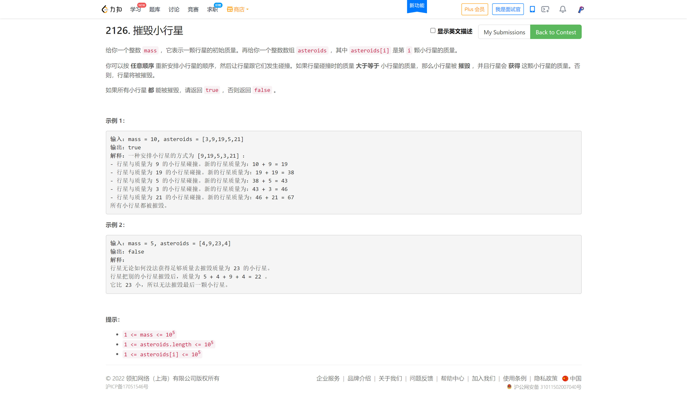
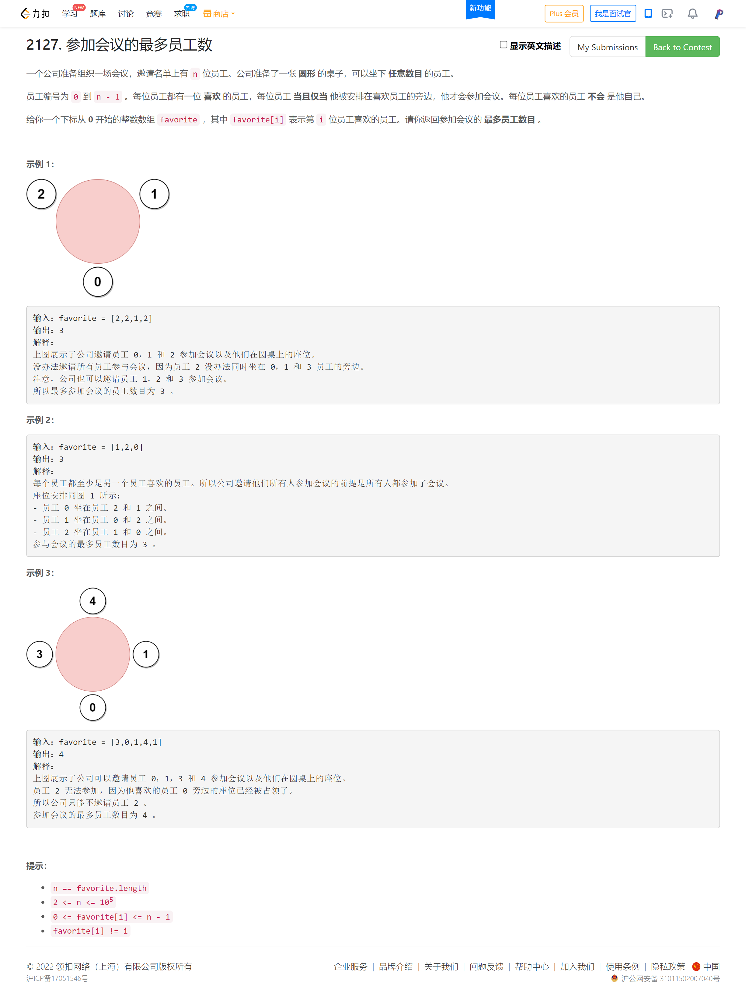
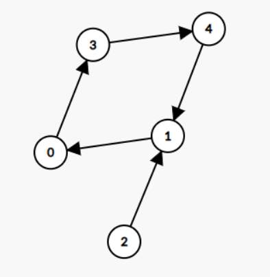
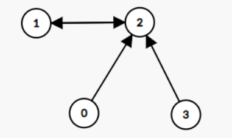
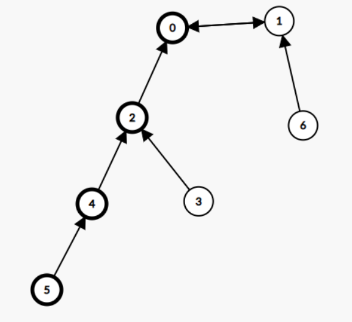

<!-- @import "[TOC]" {cmd="toc" depthFrom=1 depthTo=6 orderedList=false} -->

<!-- code_chunk_output -->

- [2126. 摧毁小行星（开 long long / 很妙的线性做法）](#2126-摧毁小行星开-long-long-很妙的线性做法)
- [2127. 参加会议的最多员工数（内向基环树：拓扑排序 + 分类讨论）](#2127-参加会议的最多员工数内向基环树拓扑排序-分类讨论)

<!-- /code_chunk_output -->

没参加。

### 2126. 摧毁小行星（开 long long / 很妙的线性做法）



我想到了开 `long long` 过了。

```cpp
class Solution {
public:
    bool asteroidsDestroyed(int mass, vector<int>& asteroids) {
        sort(asteroids.begin(), asteroids.end());

        long long total = (long long) mass;

        for (auto&& a: asteroids)
        {
            if (a > total) return false;
            total = total + (long long) a;
        }

        return true;
    }
};
```

但是何逊大佬的 $O(n)$ 做法太妙了，如下。

考虑将所有值按 $[1,2),[2,4),\cdots,[2^i,2^{i+1}],\cdots$ 分组,按顺序考虑所有非空的组，如果当前 $mass$ 小于组内最小值，那么答案是 $false$ ；如果当前 $mass$ 大于等于组内最小值，那么加上最小值之后必然大于组内所有值，所以可以直接加上组内所有值。

```cpp
class Solution {
public:
    bool asteroidsDestroyed(int mass, vector<int>& asteroids) {
        vector<int> min(17, -1);
        vector<long long> sum(17);
        for (int i = 0; i < asteroids.size(); i += 1) {
            int h = 31 - __builtin_clz(asteroids[i]);
            if (min[h] == -1 or asteroids[i] < min[h]) min[h] = asteroids[i];
            sum[h] += asteroids[i];
        }
        long long cur = mass;
        for (int i = 0; i < 17; i += 1) {
            if (cur < min[i]) return false;
            cur += sum[i];
        }
        return true;
    }
};
```

### 2127. 参加会议的最多员工数（内向基环树：拓扑排序 + 分类讨论）



[灵佬太巨](https://leetcode-cn.com/problems/maximum-employees-to-be-invited-to-a-meeting/solution/nei-xiang-ji-huan-shu-tuo-bu-pai-xu-fen-c1i1b/)了：

本文将介绍处理基环树问题的一些通用技巧。

从 $i$ 向 $\textit{favorite}[i]$ 连边，我们可以得到一张有向图。由于每个大小为 $k$ 的连通块都有 $k$ 个点和 $k$ 条边， **所以每个连通块必定有且仅有一个环，且由于每个点的出度均为 $1$，这样的有向图又叫做内向基环树 (pseudotree)，由基环树组成的森林叫基环树森林 (pseudoforest)。**

每一个内向基环树（连通块）都由一个基环和其余指向基环的树枝组成。例如示例 $3$ 可以得到如下内向基环树，其基环由节点 $0$、$1$、$3$ 和 $4$ 组成，节点 $2$ 为其树枝：



特别地，我们得到的基环可能只包含两个节点。例如示例 $1$ 可以得到如下内向基环树，其基环只包含节点 $1$ 和 $2$，而节点 $0$ 和 $3$ 组成其树枝：



对于本题来说，这两类基环树在组成圆桌时会有明显区别，下文会说明这一点。

先来看看基环大小大于 $2$ 的情况，显然基环上的节点组成了一个环，因而可以组成一个圆桌；而树枝上的点，若插入圆桌上 $v\rightarrow w$ 这两人中间，会导致节点 $v$ 无法和其喜欢的员工坐在一起，因此树枝上的点是无法插入圆桌的；此外，树枝上的点也不能单独组成圆桌，因为这样会存在一个出度为 $0$ 的节点，其无法和其喜欢的员工坐在一起。对于其余内向基环树（连通块）上的节点，和树枝同理，也无法插入该基环组成的圆桌。

因此，对于基环大小大于 $2$ 的情况，圆桌的最大员工数目即为最大的基环大小，记作 $\textit{maxRingSize}$。

下面来分析基环大小等于 $2$ 的情况。

以如下基环树为例，$0$ 和 $1$ 组成基环，其余节点组成树枝：



我们可以先让 $0$ 和 $1$ 坐在圆桌旁（假设 $0$ 坐在 $1$ 左侧），那么 $0$ 这一侧的树枝只能坐在 $0$ 的左侧，而 $1$ 这一侧的树枝只能坐在 $1$ 的右侧。

$2$ 可以紧靠着坐在 $0$ 的左侧，而 $3$ 和 $4$ 只能选一个坐在 $2$ 的左侧（如果 $4$ 紧靠着坐在 $2$ 的左侧，那么 $3$ 是无法紧靠着坐在 $4$ 的左侧的，反之亦然）。

这意味着从 $0$ 出发倒着找树枝上的点（即沿着反图上的边），每个点只能在其反图上选择其中一个子节点，因此 $0$ 这一侧的节点必须组成一条链，那么我们可以找最长的那条链，即上图加粗的节点。

对于 $1$ 这一侧也同理。将这两条最长链拼起来即为该基环树能组成的圆桌的最大员工数。

对于多个基环大小等于 $2$ 的基环树，每个基环树所对应的链，都可以拼在其余链的末尾，因此我们可以将这些链全部拼成一个圆桌，其大小记作 $\textit{sumChainSize}$。

答案即为 $\max(\textit{maxRingSize},\textit{sumChainSize})$。

**下面介绍基环树问题的通用写法。**

我们可以通过一次拓扑排序「剪掉」所有树枝，因为拓扑排序后，树枝节点的入度均为 $0$，基环节点的入度均为 $1$。这样就可以将基环和树枝分开，从而简化后续处理流程：

- 如果要遍历基环，可以从拓扑排序后入度为 $1$ 的节点出发，在图上搜索；
- 如果要遍历树枝，可以以基环与树枝的连接处为起点，顺着反图来搜索树枝（搜索入度为 $0$ 的节点），从而将问题转化成一个树形问题。

对于本题，我们可以遍历所有基环，并按基环大小分类计算：
- 对于大小大于 $2$ 的基环，我们取基环大小的最大值；
- 对于大小等于 $2$ 的基环，我们可以从基环上的点出发，在反图上找到最大的树枝节点深度。
- 时间复杂度和空间复杂度均为 $O(n)$。

```cpp
class Solution {
public:
    int maximumInvitations(vector<int> &g) { // favorite 就是内向基环森林 g
        int n = g.size();
        vector<vector<int>> rg(n); // g 的反图
        vector<int> deg(n); // g 上每个节点的入度
        for (int v = 0; v < n; ++v) {
            int w = g[v];
            rg[w].emplace_back(v);
            ++deg[w];
        }

        // 拓扑排序，剪掉 g 上的所有树枝
        queue<int> q;
        for (int i = 0; i < n; ++i) {
            if (deg[i] == 0) {
                q.emplace(i);
            }
        }
        while (!q.empty()) {
            int v = q.front();
            q.pop();
            int w = g[v]; // v 只有一条出边
            if (--deg[w] == 0) {
                q.emplace(w);
            }
        }

        // 通过反图 rg 寻找树枝上最深的链
        function<int(int)> rdfs = [&](int v) -> int {
            int max_depth = 1;
            for (int w: rg[v]) {
                if (deg[w] == 0) { // 树枝上的点在拓扑排序后，入度均为 0
                    max_depth = max(max_depth, rdfs(w) + 1);
                }
            }
            return max_depth;
        };

        int max_ring_size = 0, sum_chain_size = 0;
        for (int i = 0; i < n; ++i) {
            if (deg[i] <= 0) {
                continue;
            }
            // 遍历基环上的点（拓扑排序后入度大于 0）
            deg[i] = -1;
            int ring_size = 1;
            for (int v = g[i]; v != i; v = g[v]) {
                deg[v] = -1; // 将基环上的点的入度标记为 -1，避免重复访问
                ++ring_size;
            }
            if (ring_size == 2) { // 基环大小为 2
                sum_chain_size += rdfs(i) + rdfs(g[i]); // 累加两条最长链的长度
            } else {
                max_ring_size = max(max_ring_size, ring_size); // 取所有基环的最大值
            }
        }
        return max(max_ring_size, sum_chain_size);
    }
};
```

[@Class_](https://leetcode-cn.com/u/class_/) 指出可以在拓扑排序的同时计算出最长链的长度，这样就不需要建反图和在反图上找最长链了，从而节省不少时间、空间和代码量：

```cpp
class Solution {
public:
    int maximumInvitations(vector<int> &g) { // favorite 就是内向基环森林 g
        int n = g.size();
        vector<int> deg(n); // g 上每个节点的入度
        for (int w: g) {
            ++deg[w];
        }

        vector<int> max_depth(n);
        queue<int> q;
        for (int i = 0; i < n; ++i) {
            if (deg[i] == 0) {
                q.emplace(i);
            }
        }
        while (!q.empty()) {  // 拓扑排序，剪掉 g 上的所有树枝
            int v = q.front();
            q.pop();
            ++max_depth[v];
            int w = g[v]; // v 只有一条出边
            max_depth[w] = max(max_depth[w], max_depth[v]);
            if (--deg[w] == 0) {
                q.emplace(w);
            }
        }

        int max_ring_size = 0, sum_chain_size = 0;
        for (int i = 0; i < n; ++i) {
            if (deg[i] == 0) {
                continue;
            }
            // 遍历基环上的点（拓扑排序后入度大于 0）
            deg[i] = 0;
            int ring_size = 1;
            for (int v = g[i]; v != i; v = g[v]) {
                deg[v] = 0; // 将基环上的点的入度标记为 0，避免重复访问
                ++ring_size;
            }
            if (ring_size == 2) { // 基环大小为 2
                sum_chain_size += max_depth[i] + max_depth[g[i]] + 2; // 累加两条最长链的长度
            } else {
                max_ring_size = max(max_ring_size, ring_size); // 取所有基环的最大值
            }
        }
        return max(max_ring_size, sum_chain_size);
    }
};
```
