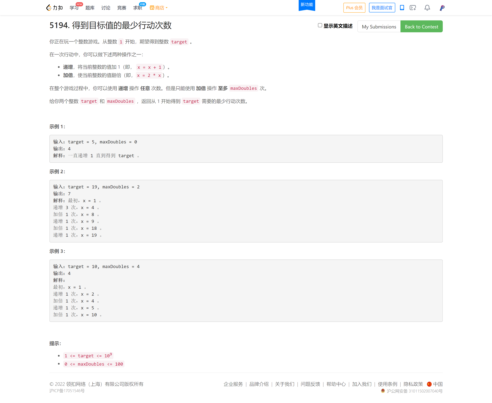
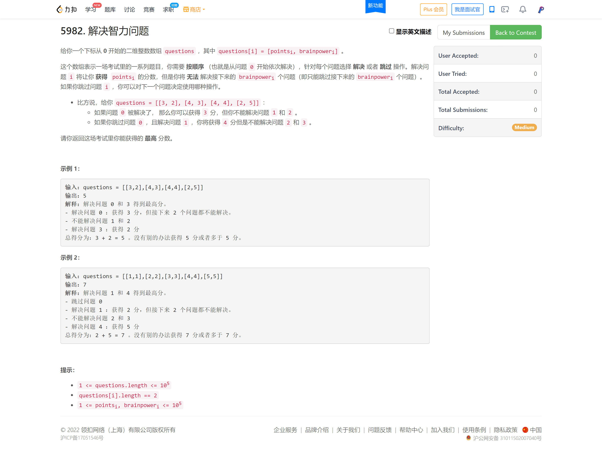
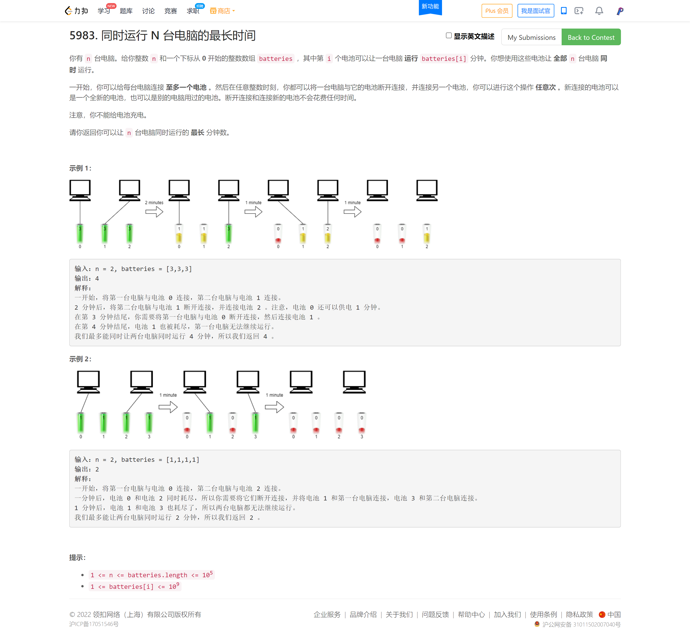

<!-- @import "[TOC]" {cmd="toc" depthFrom=1 depthTo=6 orderedList=false} -->

<!-- code_chunk_output -->

- [5194. 得到目标值的最少行动次数（贪心+逆向思维）](#5194-得到目标值的最少行动次数贪心逆向思维)
- [5982. 解决智力问题（倒序DP刷表法/正序DP查表法）](#5982-解决智力问题倒序dp刷表法正序dp查表法)
- [5983. 同时运行 N 台电脑的最长时间（假设思维+二分/贪心）](#5983-同时运行-n-台电脑的最长时间假设思维二分贪心)

<!-- /code_chunk_output -->

低谷。很失落。努力了半年多，毫无成效。思维太窄了。 T2 完全想不到逆向思维，其实是很简单的事。但至少有经验了：以后 T2 完全不至于用 bfs 做。 T3 不知道错在哪。

看来只要是贪心题我就不会。

### 5194. 得到目标值的最少行动次数（贪心+逆向思维）



我的超时代码：
```cpp
#define fi first
#define se second

typedef pair<int, int> PII;  // value, cnt2
typedef pair<int, pair<int, int>> PIII;  // dist, {count2, value}

class Solution {
public:
    int minMoves(int target, int maxDoubles) {
        // set<PII> st;
        priority_queue<PIII, vector<PIII>, greater<PIII>> pq;
        pq.push({0, {0, 1}});
        // st.insert({1, 0});
        while (pq.size())
        {
            auto t = pq.top();
            pq.pop();
            int dist = t.fi, cnt2 = t.se.fi, value = t.se.se;
            // printf("%d %d %dok\n", dist, cnt2, value);
            if (value > target) continue;
            if (value == target) return dist;
            if (cnt2 == maxDoubles)
            {
                // printf("%d %d %d\n", dist, -cnt2, value * 2);
                pq.push({dist + (target - value), {-cnt2, target}});
            }
            else
            {
                // if (!st.count({value * 2, cnt2}))
                // {
                // printf("%d %d %d\n", dist, cnt2, value * 2);
                    pq.push({dist + 1, {cnt2 + 1, value * 2}});
                    // if (value * 2 != target) st.insert({value * 2, cnt2});
                // }
                // if (!st.count({value + 1, cnt2}))
                // {
                // printf("%d %d %d\n", dist, cnt2, value + 1);
                    pq.push({dist + 1, {cnt2, value + 1}});
                    // if (value + 1 != target) st.insert({value + 1, cnt2});
                // }
            }
        }
        
        return -1;
        
        // int cnt1 = 0, cnt2 = 0;
        // function<bool(int)> dfs = [&](int value) -> bool {
        //     if (value > target) return false;
        //     if (value == target) return true;
        //     if (cnt2 < maxDoubles)
        //     {
        //         cnt2 ++ ;
        //         if (dfs(value * 2)) return true;
        //         cnt2 -- ;
        //     }
        //     else
        //     {
        //         cnt1 ++ ;
        //         if (dfs(value + 1)) return true;
        //         cnt1 -- ;
        //     }
        //     return false;
        // };
        
        // dfs(1);
        // return cnt1 + cnt2;
    }
};
```

**正确思路：**

```cpp
class Solution {
public:
    int minMoves(int target, int maxDoubles) {
        /**
         * 贪心：把乘以二留到最后，这样步数肯定最小
         * 所以逆向思维，是奇数则减一，偶数则除以二
         * 不能除了剩下的都要加一
         * 换句话说，这题保证了乘以二这个运算能发挥最大效益
         */
         int ans = 0;
         while (target != 1)
         {
             if (maxDoubles > 0)
             {
                if (target % 2)
                {
                    target -- ;
                    ans += 1;
                }
                else
                {
                    target /= 2;
                    ans += 1;
                    maxDoubles -- ;
                }
             }
             else
             {
                 ans += target - 1;
                 break;
             }
         }
         return ans;
    }
};
```

### 5982. 解决智力问题（倒序DP刷表法/正序DP查表法）



我的错误代码：

```cpp
#define fi first
#define se second

class Solution {
public:
    long long mostPoints(vector<vector<int>>& questions) {
        int n = questions.size();
        vector<pair<long long, int>> dp(n + 1, {0L, 0});
        
        function<pair<long long, int>(int)> dfs = [&](int m) -> pair<long long, int>
        {
            if (m == 0) return {0L, 0};
            if (dp[m].se != 0) return dp[m];
            auto last = dfs(m - 1);
            long long maxv = last.fi;
            int step = last.se;
            if (step <= 0)
            {
                dp[m] = {maxv + questions[m - 1][0], questions[m - 1][1]};
                return dp[m];
            }
            int k = 1;
            while (step >= k)
            {
                ++ k;
                auto t = dfs(m - k);
                maxv = t.fi;
                step = t.se;
            }

            if (maxv + questions[m - 1][0] > last.fi)
                dp[m] = {maxv + questions[m - 1][0], questions[m - 1][1]};
            else
                dp[m] = {last.fi, last.se - 1};
            return dp[m];
        };

        dfs(n);
        
        for (int i = 0; i <= n; ++ i)
            cout << dp[i].fi << " " << dp[i].se << endl;

        return dp[n].fi;
    }
};
```

上述代码的不正确性就在于：遍历到 `i` ，并且决定解决 `i` ，那么我往前走，看看选 `i` 的情况下，之前顶多能选多少 `j (j <= i)`，所以我这里更新公式 `f[i] = max(f[j] + q[i], f[i - 1])` 表示的是，在解决本题和不解决本题间取最大值。

**这样是不对的，因为我们这里用 `f[j] + q[i]` 根本无法表示选择解决 i 的情况下的最优。为什么？因为选择解决 i ，并不一定要与 j 相加，可能 `f[i-1]` 中也没有去解决 i-1 这个问题，而是解决了 i-2 这个问题，且这个问题的步长只有一步，可以用 `f[i-1]+q[i]`来表示解决 i 下的最优。**

所以这里，转移公式根本就是不对的。

```
正确：
[[3,2],[4,3],[4,4],[2,5]]
[[1,1],[2,2],[3,3],[4,4],[5,5]]
输出：
5
7

错误：
[[21,2],[1,2],[12,5],[7,2],[35,3],[32,2],[80,2],[91,5],[92,3],[27,3],[19,1],[37,3],[85,2],[33,4],[25,1],[91,4],[44,3],[93,3],[65,4],[82,3],[85,5],[81,3],[29,2],[25,1],[74,2],[58,1],[85,1],[84,2],[27,2],[47,5],[48,4],[3,2],[44,3],[60,5],[19,2],[9,4],[29,5],[15,3],[1,3],[60,2],[63,3],[79,3],[19,1],[7,1],[35,1],[55,4],[1,4],[41,1],[58,5]]
输出：737
预期：781
```

正确思路参考灵佬，以后都不多说了，没指明出处，说的就是他：[endlesscheng](https://leetcode-cn.com/problems/solving-questions-with-brainpower/solution/dao-xu-dp-by-endlesscheng-2qkc/)。

**解法一：倒序 DP（查表法）**

设有 $n$ 个问题，定义 $f[i]$ 表示解决区间 $[i,n-1]$ 内的问题可以获得的最高分数。

倒序遍历问题列表，对于第 $i$ 个问题，我们有两种决策：跳过或解决。

- 若跳过，则有 $f[i]=f[i+1]$。
- 若解决，则需要跳过后续 $\textit{brainpower}[i]$ 个问题。记 $j=i+\textit{brainpower}[i]+1$ ，则有

$$
f[i] = \begin{cases} \textit{point}[i]+f[j],&j<n\\ \textit{point}[i],&j\ge n \end{cases}
$$

这两种决策取最大值。

最后答案为 $f[0]$。

```cpp
class Solution {
public:
    long long mostPoints(vector<vector<int>>& questions) {
        int n = questions.size();
        vector<long long> f(n + 1, 0);
        for (int i = n - 1; i >= 0; -- i)
        {
            auto &q = questions[i];
            int j = i + q[1] + 1;
            f[i] = max(f[i + 1], q[0] + (j >= n ? 0 : f[j]));
        }
        return f[0];
    }
};
```

**解法二：正序 DP（刷表法）**

定义 $f[i]$ 表示解决区间 $[0,i]$ 内的问题可以获得的最高分数。

对于问题 $i$，若跳过，则可以更新 $f[i+1]=\max(f[i+1],f[i])$。

若不跳过，记 $j=i+\textit{brainpower}[i]+1$，则可以更新 $f[j]=\max(f[j],f[i]+\textit{point}[i])$。

对于 i=n-1i=n−1 和 j\ge nj≥n 的情况，为了简化代码逻辑，我们可以将其更新到 $f[n]$ 中。

最后答案为 $f[n]$。

```cpp
class Solution {
public:
    long long mostPoints(vector<vector<int>>& questions) {
        int n = questions.size();
        vector<long long> f(n + 1, 0);
        for (int i = 0; i < n; ++ i)
        {
            auto &q = questions[i];
            f[i + 1] = max(f[i], f[i + 1]);
            int j = min(q[1] + i + 1, n);
            f[j] = max(q[0] + f[i], f[j]);
        }
        return f[n];
    }
};
```

### 5983. 同时运行 N 台电脑的最长时间（假设思维+二分/贪心）



**解法一：二分答案**

假设我们可以让 $n$ 台电脑同时运行 $x$ 分钟，那么对于电量大于 $x$ 的电池，其只能被使用 $x$ 分钟。因此每个电池的使用时间为 $\min(\textit{batteries}[i], x)$，我们将其累加起来，记作 $\textit{sum}$。那么要让 $n$ 台电脑同时运行 $x$ 分钟，必要条件是 $n\cdot x\le \textit{sum}$。

下面证明该条件是充分的，即当 $n\cdot x\le \textit{sum}$ 成立时，必然可以让 $n$ 台电脑同时运行 $x$ 分钟。

对于电量不小于 $x$ 的电池，我们可以让其给一台电脑供电 $x$ 分钟。由于一个电池不能同时给多台电脑供电，因此该电池若给一台电脑供电 $x$ 分钟，那它就不能用于其他电脑了。我们可以将所有电量不小于 $x$ 的电池各给一台电脑供电。

对于其余的电池，设其电量和为 $\textit{sum}'$，剩余 $n'$ 台电脑未被供电。我们可以随意选择剩下的电池，供给剩余的第一台电脑，多余的电池电量供给剩余的第二台电脑，依此类推。注意由于这些电池的电量小于 $x$，按照这种做法是不会出现同一个电池在同一时间供给多台电脑的。

由于 $\textit{sum}'=\textit{sum}-(n-n')\cdot x$，结合 $n\cdot x\le \textit{sum}$可以得到 $n'\cdot x\le \textit{sum}$，这意味着剩余电池可以让剩余电脑运行 $x$ 分钟。充分性得证。

如果我们可以让 $n$ 台电脑同时运行 $x$ 分钟，那么必然也可以同时运行低于 $x$ 分钟，因此答案满足单调性，可以二分答案，通过判断 $n\cdot x\le \textit{sum}$ 来求解。

```cpp
class Solution {
public:
    long long maxRunTime(int n, vector<int>& batteries) {
        // 二分，找符合要求的最大的 x
        long long l = 0, r = accumulate(batteries.begin(), batteries.end(), 0L);
        while (l < r)
        {
            long long mid = l + r + 1 >> 1, sum = 0;
            for (long long &&b: batteries)
                sum += min(b, mid);
            if (sum >= n * mid) l = mid;
            else r = mid - 1;
        }
        return l;
    }
};
```

**解法二：排序 + 贪心**

受解法一的启发，我们可以得出如下贪心策略：

记电池电量和为 $\textit{sum}$，则至多可以供电 $x=\lfloor\dfrac{\textit{sum}}{n}\rfloor$ 分钟。我们对电池电量从大到小排序，然后从电量最大的电池开始遍历：

若该电池电量超过 $x$，则将其供给一台电脑，问题缩减为 $n−1$ 台电脑的子问题。

若该电池电量不超过 $x$，则其余电池的电量均不超过 $x$，此时有

$$
n\cdot x=n\cdot\lfloor\dfrac{\textit{sum}}{n}\rfloor \le \textit{sum}
$$

根据解法一的结论，这些电池能至多供电 $x$ 分钟。

由于随着问题规模减小，$x$ 不会增加，因此若遍历到一个电量不超过 $x$ 的电池时，可以直接返回 $x$ 作为答案。

```cpp
class Solution {
public:
    long long maxRunTime(int n, vector<int>& batteries) {
        // 贪心，当最大电池🔋不足以支持单机运行时，把 sum/n 返回
        long long sum = accumulate(batteries.begin(), batteries.end(), 0L);
        sort(batteries.rbegin(), batteries.rend());
        for (long long &&b: batteries)
        {   // sum / n 是考虑 n 台电脑能坚持多久
            // 如果 b > sum / n 则电池 b 顶多用 b 这么多电量，抛弃不看
            if (b <= sum / n) return sum / n;
            sum -= b;
            n -- ;
        }
        return -1;
    }
};
```
