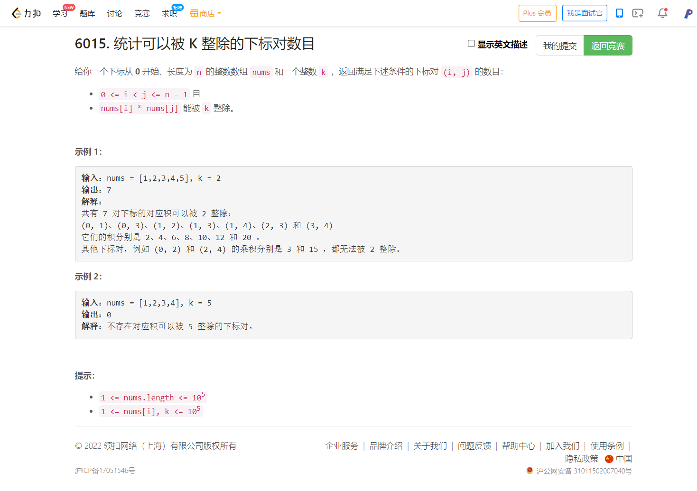

<!-- @import "[TOC]" {cmd="toc" depthFrom=1 depthTo=6 orderedList=false} -->

<!-- code_chunk_output -->

- [6015. 统计可以被 K 整除的下标对数目（预处理+统计因子出现次数）](#6015-统计可以被-k-整除的下标对数目预处理统计因子出现次数)

<!-- /code_chunk_output -->

T4 毫无思路，又似乎是一道简单题。

### 6015. 统计可以被 K 整除的下标对数目（预处理+统计因子出现次数）



```cpp
const int MAXN = 1e5 + 10;
vector<int> divisor[MAXN + 1];

int temp = []() {  // 一定要放在 Solution 外面，虽然是 NlogN 的，但每次都执行也会 TLE
    for (int i = 1; i < MAXN; ++ i)
        for (int j = i; j < MAXN; j += i)
            divisor[j].push_back(i);
    return 0;
}();

class Solution {
public:
    long long coutPairs(vector<int>& nums, int k) {
        int n = nums.size();
        unordered_map<int, int> cnt;
        long long res = 0;
        for (auto&& t: nums)
        {
            res += cnt[k / gcd(t, k)];
            for (auto&& v: divisor[t])
                cnt[v] ++ ;
        }
        return res;
    }
};
```

**经验：**
- $[1,10^5]$ 内 83160 的因子个数最多，只有 128 个。因此可以开容器记录所有元素的因子
- 可以用 lambda 在全局域静态预处理

如下，还可以再优化一下，只考虑跟 k 有关的因子。

```cpp
class Solution {
public:
    long long coutPairs(vector<int>& nums, int k) {
        vector<int> divisor;
        for (int i = 1; i * i <= k; ++ i)
            if (k % i == 0)
            {
                divisor.push_back(i);
                if (i * i < k) divisor.push_back(k / i);
            }
        unordered_map<int, int> cnt;
        long long res = 0;
        for (auto&& t: nums)
        {
            res += cnt[k / gcd(t, k)];
            for (auto&& d: divisor)  // 只有与 k 有关的因子之后能发挥作用
                if (t % d == 0) cnt[d] ++ ;
        }
        return res;
    }
};
```
