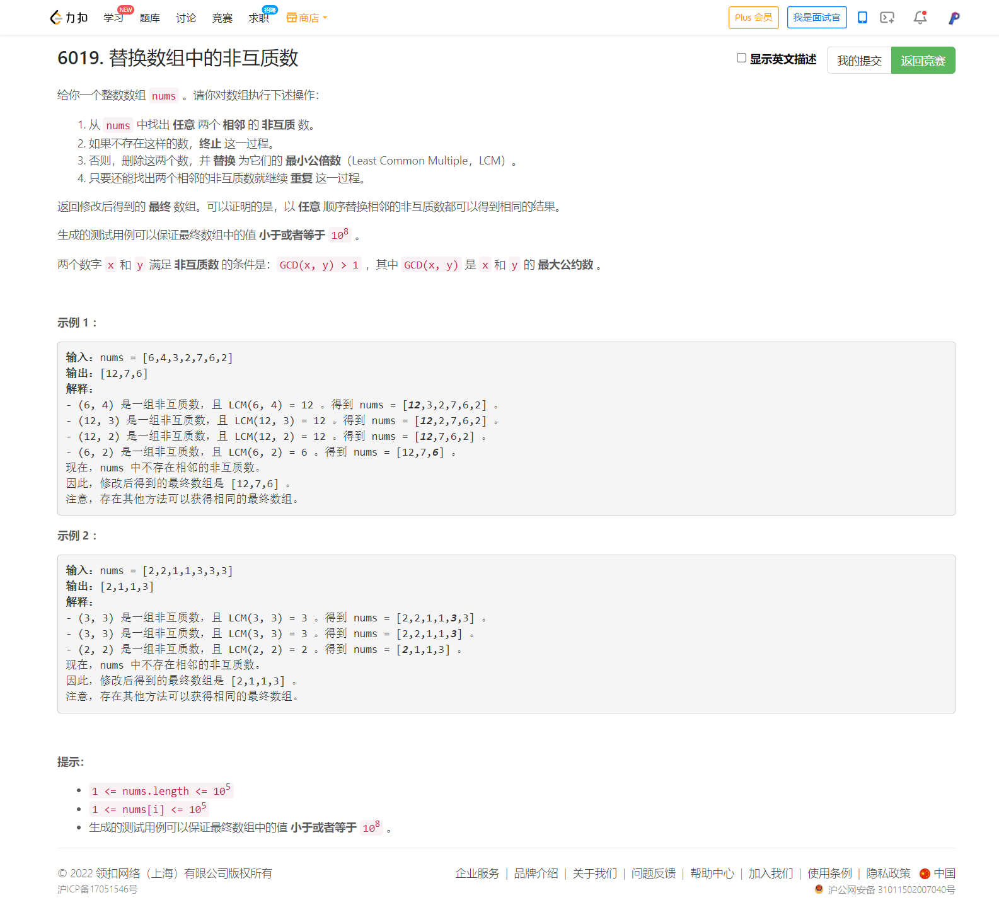

<!-- @import "[TOC]" {cmd="toc" depthFrom=1 depthTo=6 orderedList=false} -->

<!-- code_chunk_output -->

- [6019. 替换数组中的非互质数（利用栈顶合并区间+GCD求LCM）](#6019-替换数组中的非互质数利用栈顶合并区间gcd求lcm)

<!-- /code_chunk_output -->

在`沈阳北->天津西`动车 iPad 上的周赛。

T4 其实很简单。我之前不知道，现在明确了：自动合并区间中相邻元素（类似 2048 小游戏），用栈可以很好地优化。

### 6019. 替换数组中的非互质数（利用栈顶合并区间+GCD求LCM）



```cpp
class Solution {
public:
    vector<int> replaceNonCoprimes(vector<int>& nums) {
        vector<int> stk;
        for (int i = 0; i < nums.size(); ++ i)
        {
            int x = nums[i];
            // 往下压栈，合并栈顶元素，直到不能合并
            while (stk.size() > 0 && __gcd(stk.back(), x) > 1)
            {
                x = x / __gcd(stk.back(), x) * stk.back();
                stk.pop_back();
            }
            stk.push_back(x);
        }
        return stk;
    }
};
```
