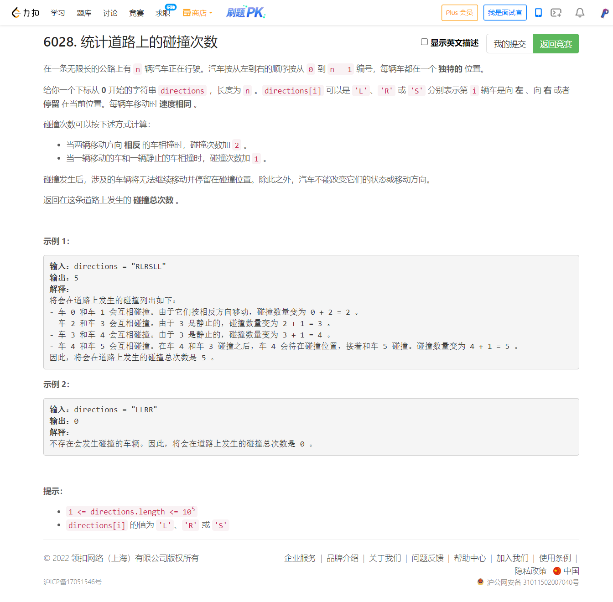
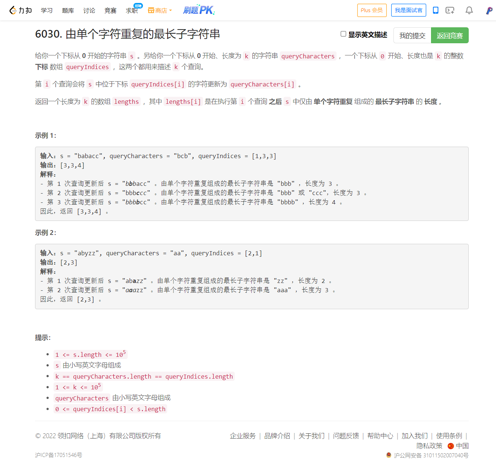

<!-- @import "[TOC]" {cmd="toc" depthFrom=1 depthTo=6 orderedList=false} -->

<!-- code_chunk_output -->

- [6028. 统计道路上的碰撞次数（思维题）](#6028-统计道路上的碰撞次数思维题)
- [6030. 由单个字符重复的最长子字符串（线段树）](#6030-由单个字符重复的最长子字符串线段树)

<!-- /code_chunk_output -->


T2 做的很慢，所幸没有 WA ，我想看看高手怎么做的。

T3 状压，其实很简单，一开始被我想成 DP 了，后来一看要求给出解决方案，再结合数据范围，知道了是状压。

T4 线段树，卡了几个样例，我应该是给想复杂了。

### 6028. 统计道路上的碰撞次数（思维题）



下面我这个思路很麻烦。

```cpp
class Solution {
public:
    int countCollisions(string d) {
        int n = d.size();
        int l = 0, r = 0;  // 0 停/相撞 x 向中间数量
        int i = 0, j = n - 1;
        while (i <= j && d[i] == 'L') ++ i;
        while (j >= i && d[j] == 'R') -- j;
        int res = 0;
        while (i <= j)
        {
            if (d[i] == 'S')
            {
                res += l;
                l = 0;
                ++ i;
            }
            else if (d[i] == 'R')
            {
                l = 1;
                ++ i;
                while (i < j && d[i] == 'R') ++ i, ++ l;
            }
            else
            {
                res += l + 1;
                l = 0;
                // cout << i << " " << d[i] << " " << res << endl;
                ++ i;
            }
        }
        return res;
    }
};
```

灵佬的思路绝了：

```python
class Solution:
    def countCollisions(self, s: str) -> int:
        s = s.lstrip('L')  # 前缀向左的车不会发生碰撞
        s = s.rstrip('R')  # 后缀向右的车不会发生碰撞
        return len(s) - s.count('S')  # 剩下非停止的车必然会碰撞
```


### 6030. 由单个字符重复的最长子字符串（线段树）



考试时思路有瑕疵，卡样例了。看了灵佬的分析，一下就过了。太清晰了。

做法类似求动态最大子段和（洛谷 P4513 小白逛公园 https://www.luogu.com.cn/problem/P4513 ），线段树的每个节点维护对应区间的：

- 前缀最长连续字符个数 $\textit{pre}$；
- 后缀最长连续字符个数 $\textit{suf}$；
- 该区间最长连续字符个数 $\textit{max}$。

合并两个子区间时，如果前一个区间（记作 a）的末尾字符等于后一个区间（记作 b）的第一个字符，则可以合并这两个区间：

如果 a 的 $\textit{suf}$ 等于 a 的长度，那么就可以更新合并后的区间的 $\textit{pre}$ 值；
如果 b 的 $\textit{pre}$ 等于 b 的长度，那么就可以更新合并后的区间的 $\textit{suf}$ 值；
如果上面两个不成立，那么 $\textit{a.suf} + \textit{b.pre}$ 可以考虑成为合并后的区间的 $\textit{max}$。

```cpp
class Solution {
    static const int N = 4e5 + 10;
    string s;
    struct TreeNode {
        int l, r;
        char lc, rc, dc;
        int lmax, rmax, dmax;
    } tr[N];
    
    void pushup(TreeNode &f, TreeNode &l, TreeNode &r)
    {
        if (l.r - l.l + 1 == lmax)
    }
    
    void build(int u, int l, int r)
    {
        if (l == r)
        {
            tr[u] = { l, l, s[l - 1], s[l - 1], s[l - 1], 1, 1, 1 };
            return ;
        }
        tr[u].l = l; tr[u].r = r;
        int mid = l + r >> 1;
        build(u * 2, l, mid);
        build(u * 2 + 1, mid + 1, r);
        pushup(tr[u], tr[u * 2], tr[u * 2 + 1]);
    }
    
    TreeNode query(int u, int l, int r)
    {
        if (tr[u].l >= l && tr[u].r <= r) return tr[u];
        int mid = tr[u].l + tr[u].r >> 1;
        if (r <= mid) return query(u * 2, l, r);
        else if (l > mid) return query(u * 2 + 1, l, r);
        else
        {
            TreeNode lt = query(u * 2, l, r);
            TreeNode rt = query(u * 2 + 1, l, r);
            TreeNode tmp;
            pushup(tmp, lt, rt);
            return tmp;
        }
    }
    
    void modify(int u, int x, char y)
    {
        if (tr[u].l == x && tr[u].r == x)
        {
            tr[u] = { x, x, y, y, y, 1, 1, 1 };
            return ;
        }
        int mid = tr[u].l + tr[u].r >> 1;
        if (x <= mid) modify(u * 2, x, y);
        else if (x > mid) modify(u * 2 + 1, x, y);
        pushup(tr[u], tr[u * 2], tr[u * 2 + 1]);
    }
public:
    vector<int> longestRepeating(string s, string queryCharacters, vector<int>& queryIndices) {
        this->s = s;
        build(1, 1, s.size());
        vector<int> ans;
        for (int i = 0; i < queryCharacters.size(); ++ i)
        {
            modify(1, queryIndices[i] + 1, queryCharacters[i]);
            ans.push_back(query(1, 1, s.size()).dmax);
        }
        return ans;
    }
};
```

