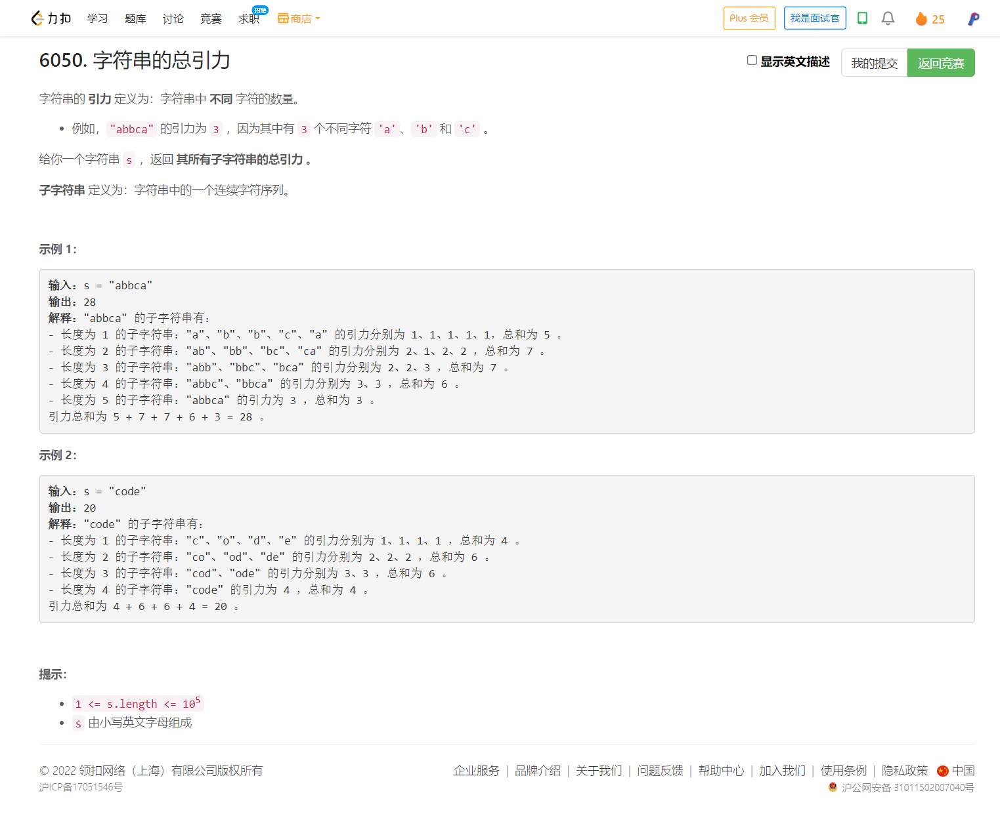

<!-- @import "[TOC]" {cmd="toc" depthFrom=1 depthTo=6 orderedList=false} -->

<!-- code_chunk_output -->

- [6050. 字符串的总引力（字符串子串计数DP）](#6050-字符串的总引力字符串子串计数dp)

<!-- /code_chunk_output -->

T3 就是很简单很简单的暴力，读题不细致导致慢了。 T4 就是套路题，见过就见过了。

### 6050. 字符串的总引力（字符串子串计数DP）



```cpp
class Solution {
public:
    long long appealSum(string s) {
        int n = s.size();
        long long f[n + 1];
        memset(f, 0, sizeof f);
        int last[26];
        memset(last, 0, sizeof last);
        long long res = 0;
        for (int i = 1; i <= n; ++ i)
        {
            // f[i] 表示前 i 字符构成的子串总引力和
            int t = i - last[s[i - 1] - 'a'];
            f[i] = f[i - 1] + t;  // t 为 f[i-1] 中多少个子串能再前加上 i 的引力
            last[s[i - 1] - 'a'] = i;
            res += f[i];
        }
        return res;
    }
};
```

此外参考[daydayuppp](https://leetcode-cn.com/problems/total-appeal-of-a-string/solution/daydayuppp-by-daydayuppp-oow3/)，可以对每一个字符单独计算它的贡献值。

对某一个字符 c , **我们把某一个子串 s' 中 c 的贡献为该 s' 中 第一个 c 所产生的贡献。**

比如 `s' = "abab"` , 那么这个串中 a 的贡献的分数算在 a(1) 上 , b 的贡献的分数算在 b(0) 上 , 括号中表示下标。

```cpp
class Solution {
public:
    long long appealSum(string s) {
        long long res =0;
        int n = s.size();
        long long a,b;
        vector<vector<int>> mp(26);// mp[i] = {p_0,p_1,...} , 'a' + i 的位置的数组
        for(int i = 0;i < n;i ++) {
            mp[s[i] - 'a'].push_back(i);
        }
        for(int i = 0;i < 26;i ++) {
            if(mp[i].empty()) continue;
            a = mp[i][0];  // 对第一个特殊处理
            b = n - mp[i][0] - 1;
            res += (a + 1) * (b + 1);
            for(int j = 1;j < mp[i].size();j ++) {
                a = mp[i][j] - mp[i][j-1] - 1;
                b = n - mp[i][j] - 1;
                res += (a + 1) * (b + 1);
            }
        }
        return res;
    }
};
```
