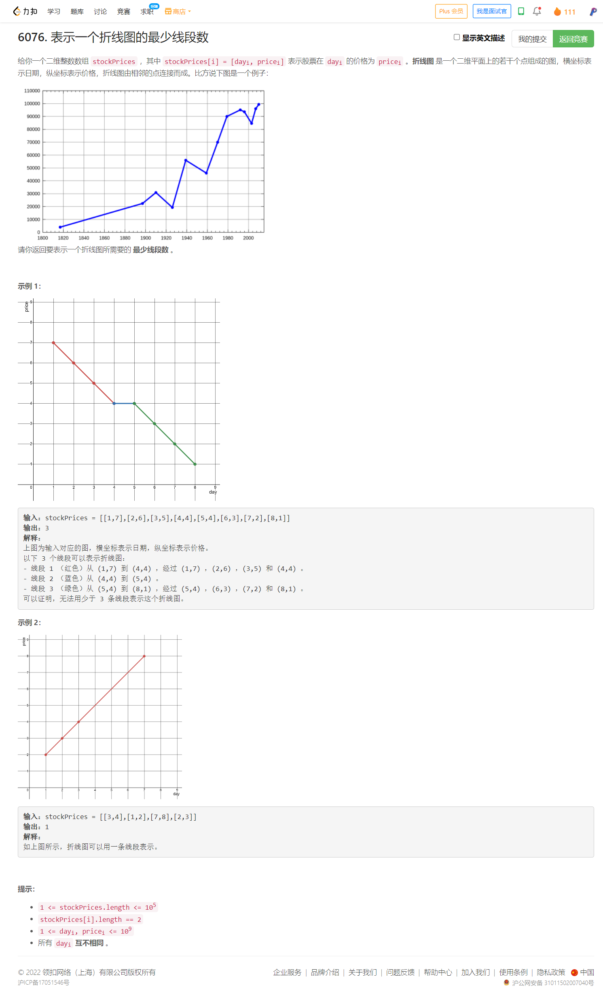
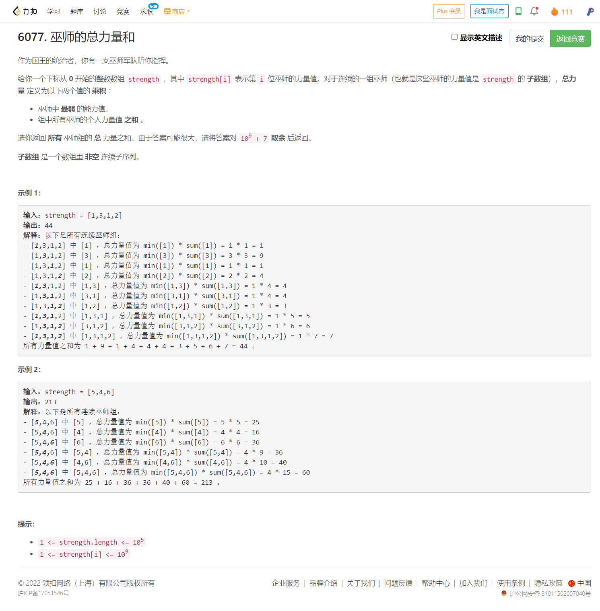

<!-- @import "[TOC]" {cmd="toc" depthFrom=1 depthTo=6 orderedList=false} -->

<!-- code_chunk_output -->

- [6076. 表示一个折线图的最少线段数（数学判断三点共线不要用除法，乘法dx1 × dy2 == dx2 × dy1）](#6076-表示一个折线图的最少线段数数学判断三点共线不要用除法乘法dx1-dy2-dx2-dy1)
- [6077. 巫师的总力量和](#6077-巫师的总力量和)

<!-- /code_chunk_output -->

没参加。第三题灵佬有一个好思路，判断三点共线不要用除法，而是乘法（`dx * predy == dy * predx`）。

### 6076. 表示一个折线图的最少线段数（数学判断三点共线不要用除法，乘法dx1 × dy2 == dx2 × dy1）



```cpp
class Solution {
public:
    int minimumLines(vector<vector<int>>& stockPrices) {
        sort(stockPrices.begin(), stockPrices.end());  // vector 自带 <
        int ans = 0;
        for (int i = 1, predx = 0, predy = 1; i < stockPrices.size(); ++ i)
        {
            long long dy = stockPrices[i][1] - stockPrices[i - 1][1];
            long long dx = stockPrices[i][0] - stockPrices[i - 1][0];
            if (dx * predy != dy * predx)
                ++ ans;
            predy = dy;
            predx = dx;
        }
        return ans;
    }
};
```

### 6077. 巫师的总力量和



看灵佬的[B站](https://www.bilibili.com/video/BV1RY4y157nW)，分析的太狠了。

