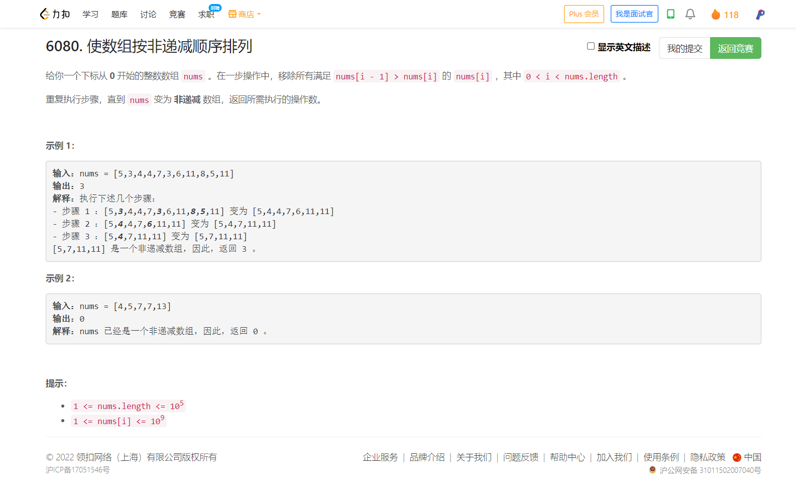

<!-- @import "[TOC]" {cmd="toc" depthFrom=1 depthTo=6 orderedList=false} -->

<!-- code_chunk_output -->

- [6080. 使数组按非递减顺序排列（双向链表 list 模拟）](#6080-使数组按非递减顺序排列双向链表-list-模拟)

<!-- /code_chunk_output -->

T3 有点神奇，自己也算分析了好几波，结合单调栈做了，但是也没做出来。

T4 太简单了。不记录。

### 6080. 使数组按非递减顺序排列（双向链表 list 模拟）



有大佬用直接用双线链表模拟了。

```cpp
class Solution {
 public:
  int totalSteps(vector<int>& nums) {
    list<int> l(nums.begin(), nums.end());
    using iter = list<int>::iterator;
    queue<iter> q;
    int ans = 0;
    // 倒着把各个节点（不包括第一个放进来）
    for (auto it = l.end(); it != l.begin(); --it) q.push(it);
    iter last;
    while (!q.empty()) {
      for (int i = 0, n = q.size(); i < n; ++i) {
        auto it = q.front();
        q.pop();
        if (it == l.begin() || it == l.end()) continue;
        auto pre = prev(it);
        auto nxt = next(it);
        if (*pre > *it) {
          // cout << *pre << " " << *it << " " << *nxt << " " << ans << endl;
          l.erase(it);
          // 如果上一次 nxt 已经加入过 q ，则这里不应再加入
          // 否则对于 [7,14,4,14,13,2,6,13] 6 会再进入队列 2 次
          // 并且在第二次出队前被删除
          // 换言之，如果 last == nxt ，说明删掉了连续的节点，没必要重复入 nxt
          if (last != nxt) q.push(nxt), last = nxt;
          // q.push(nxt);
        }
      }
      ++ans;
    }
    return ans - 1;
  }
};
// https://leetcode.cn/u/the-last-pieces/
```
