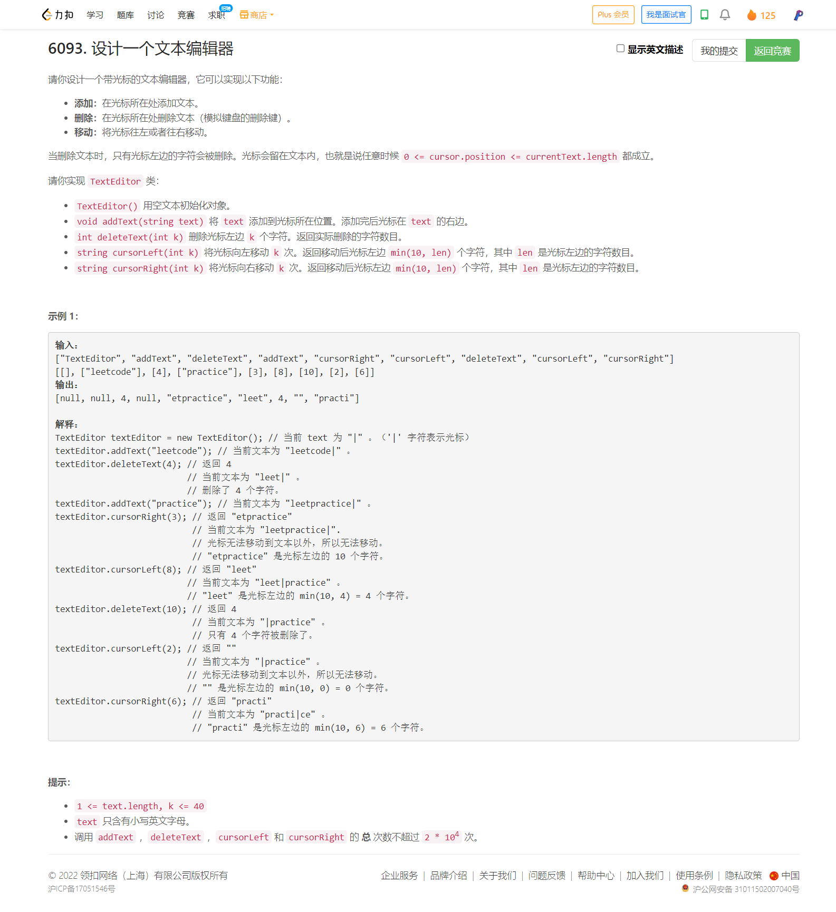

<!-- @import "[TOC]" {cmd="toc" depthFrom=1 depthTo=6 orderedList=false} -->

<!-- code_chunk_output -->

- [6093. 设计一个文本编辑器（双线链表 list 模拟）](#6093-设计一个文本编辑器双线链表-list-模拟)

<!-- /code_chunk_output -->

T4 很简单？也许可以这么说。根据数据范围和题目，很容易想到使用一般的算法就可以（或者说直接暴力模拟就可以）。但是 C++ 和 `substr` 似乎很慢，让我 WA 了一下，然后改成 `list` 双线链表就过了。

T4 狗逼之处在于，使用 Python3 的切片直接就能过。一样的思路，凭什么 Python3 就能过， C++ 过不了呢？总而言之，这道题是公认的出得不好。

### 6093. 设计一个文本编辑器（双线链表 list 模拟）



```cpp
class TextEditor {
    // string t;
    list<char> t;
    std::list<char>::iterator p;
public:
    TextEditor() {
        t.clear();
        p = t.begin();
    }
    
    void addText(string text) {
        // string pre = t.substr(0, p);
        // string sub = t.substr(p);
        // t = pre + text + sub;
        // p += text.size();
        // cout << t << endl;

        for (auto&& c: text)
            t.insert(p, c);
    }

    int deleteText(int k) {
        // k = min(k, p);
        // int i = p - k;
        // string pre = t.substr(0, i);
        // string sub = t.substr(p);
        // t = pre + sub;
        // p = p - k;
        // return k;

        // for (auto x = t.begin(); x != t.end(); x = next(x))
        //     cout << *x;
        // cout << endl;
        
        int kk = k;
        while (kk --)
        {
            if (p == t.begin())
            {
                // for (auto x = t.begin(); x != t.end(); x = next(x))
                //     cout << *x;
                // cout << endl;
                return k - kk - 1;
            }
            auto pre = prev(p);
            t.erase(pre);
        }
        
        // for (auto x = t.begin(); x != t.end(); x = next(x))
        //     cout << *x;
        // cout << endl;
        
        return k;
    }
    
    string cursorLeft(int k) {
        // k = min(k, p);
        // p = p - k;
        // int len = min(10, p);
        // int i = max(0, p - len);
        // string res = t.substr(i, len);
        // return res;
        
        while (k --)
        {
            if (p == t.begin()) break;
            auto pre = prev(p);
            p = pre;
        }

        string res;
        int cnt = 0;
        if (p == t.begin()) return res;
        for (auto x = prev(p); cnt < 10; x = prev(x), cnt = cnt + 1)
        {
            res += *x;
            if (x == t.begin()) break;
        }
        reverse(res.begin(), res.end());
        return res;
    }
    
    string cursorRight(int k) {
        // k = min(k, (int) t.size() - p);
        // p = p + k;
        // int len = min(10, p);
        // int i = max(0, p - len);
        // string res = t.substr(i, len);
        // return res;
        
        while (k --)
        {
            if (p == t.end()) break;
            auto nex = next(p);
            p = nex;
        }
        string res;
        int cnt = 0;
        if (p == t.begin()) return res;
        for (auto x = prev(p); cnt < 10; x = prev(x), cnt = cnt + 1)
        {
            res += *x;
            if (x == t.begin()) break;
        }
        reverse(res.begin(), res.end());
        return res;
    }
};

/**
 * Your TextEditor object will be instantiated and called as such:
 * TextEditor* obj = new TextEditor();
 * obj->addText(text);
 * int param_2 = obj->deleteText(k);
 * string param_3 = obj->cursorLeft(k);
 * string param_4 = obj->cursorRight(k);
 */
```

上面是我的代码。下面是灵佬的。

```cpp
class TextEditor {
    list<char> l;
    list<char>::iterator cur = l.begin();

public:
    TextEditor() {}

    void addText(string text) {
        for (char ch : text)
            l.insert(cur, ch);
    }

    int deleteText(int k) {
        int k0 = k;
        for (; k && cur != l.begin(); --k)
            cur = l.erase(prev(cur));
        return k0 - k;
    }

    string text() {
        string s;
        auto it = cur;
        for (int k = 10; k && it != l.begin(); --k) {
            it = prev(it);
            s += *it;
        }
        reverse(s.begin(), s.end());
        return s;
    }

    string cursorLeft(int k) {
        for (; k && cur != l.begin(); --k)
            cur = prev(cur);
        return text();
    }

    string cursorRight(int k) {
        for (; k && cur != l.end(); --k)
            cur = next(cur);
        return text();
    }
};
```

灵佬的双线链表代码中， Java 和 Python3 不自带数据结构，需要手写， Go 是带有 `list.List` 的。这里记录一下 Go 的代码。注意， `list` 不自带哨兵节点。

```go
type TextEditor struct {
	*list.List
	cur *list.Element
}

func Constructor() TextEditor {
	l := list.New()
	return TextEditor{l, l.PushBack(nil)} // 哨兵节点
}

func (l *TextEditor) AddText(text string) {
	for _, ch := range text {
		l.cur = l.InsertAfter(byte(ch), l.cur)
	}
}

func (l *TextEditor) DeleteText(k int) int {
	k0 := k
	for ; k > 0 && l.cur.Value != nil; k-- {
		pre := l.cur.Prev()
		l.Remove(l.cur)
		l.cur = pre
	}
	return k0 - k
}

func (l *TextEditor) text() string {
	s := []byte{}
	for k, cur := 10, l.cur; k > 0 && cur.Value != nil; k-- {
		s = append(s, cur.Value.(byte))
		cur = cur.Prev()
	}
	for i, n := 0, len(s); i < n/2; i++ {
		s[i], s[n-1-i] = s[n-1-i], s[i] // reverse s
	}
	return string(s)
}

func (l *TextEditor) CursorLeft(k int) string {
	for ; k > 0 && l.cur.Value != nil; k-- {
		l.cur = l.cur.Prev()
	}
	return l.text()
}

func (l *TextEditor) CursorRight(k int) string {
	for ; k > 0 && l.cur.Next() != nil; k-- {
		l.cur = l.cur.Next()
	}
	return l.text()
}
```

此外，再记录一个第 1 名的优雅代码，使用 C++ `string` 写的，大佬真的是动脑子了。速度也比 `list` 快。

```cpp
// https://leetcode.cn/contest/weekly-contest-296/ranking/
class TextEditor {
    string s,t;
public:
    TextEditor() {
        s=t="";
    }
    
    void addText(string text) {
        s+=text;
    }
    
    int deleteText(int k) {
        if(s.size()<k)k=s.size();
        int i;
        for(i=0;i<k;i++)s.pop_back();
        return k;
    }
    
    string cursorLeft(int k) {
        if(s.size()<k)k=s.size();
        int i;
        for(i=0;i<k;i++)
        {
            t.push_back(s.back());
            s.pop_back();
        }
        string ans(s.end()-min(10,int(s.size())),s.end());
        return ans;
    }
    
    string cursorRight(int k) {
        if(t.size()<k)k=t.size();
        int i;
        for(i=0;i<k;i++)
        {
            s.push_back(t.back());
            t.pop_back();
        }
        string ans(s.end()-min(10,int(s.size())),s.end());
        return ans;
    }
};
```
