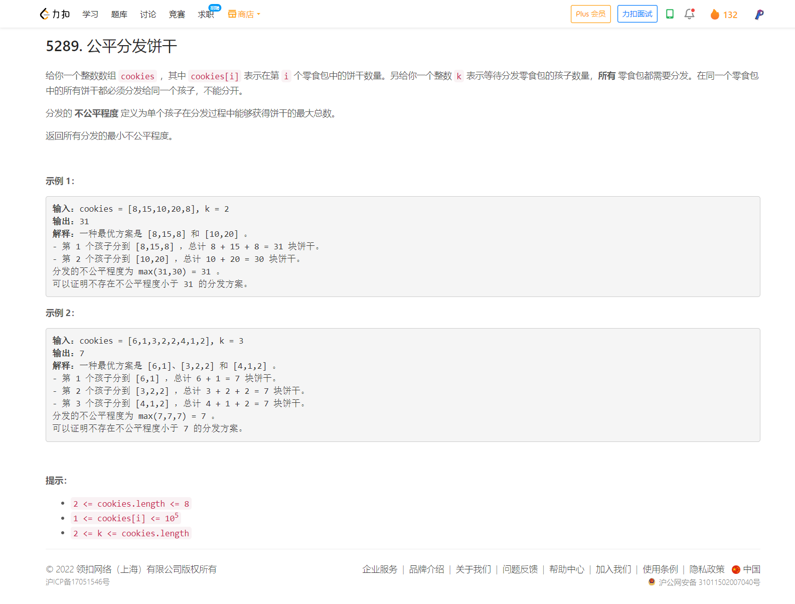

<!-- @import "[TOC]" {cmd="toc" depthFrom=1 depthTo=6 orderedList=false} -->

<!-- code_chunk_output -->

- [5270. 网格中的最小路径代价](#5270-网格中的最小路径代价)
- [5289. 公平分发饼干](#5289-公平分发饼干)
- [6094. 公司命名](#6094-公司命名)

<!-- /code_chunk_output -->

昨晚睡了不到 5 个小时，早上急急忙忙起来家教。家教完了来打周赛。 T2 T3 看似简单但是自己也没做出来，当时也没心力去调了。 T4 想了一下试了一下无所谓了。

没什么，掉分就掉分吧。以后还会参加的。

### 5270. 网格中的最小路径代价

### 5289. 公平分发饼干

### 6094. 公司命名

