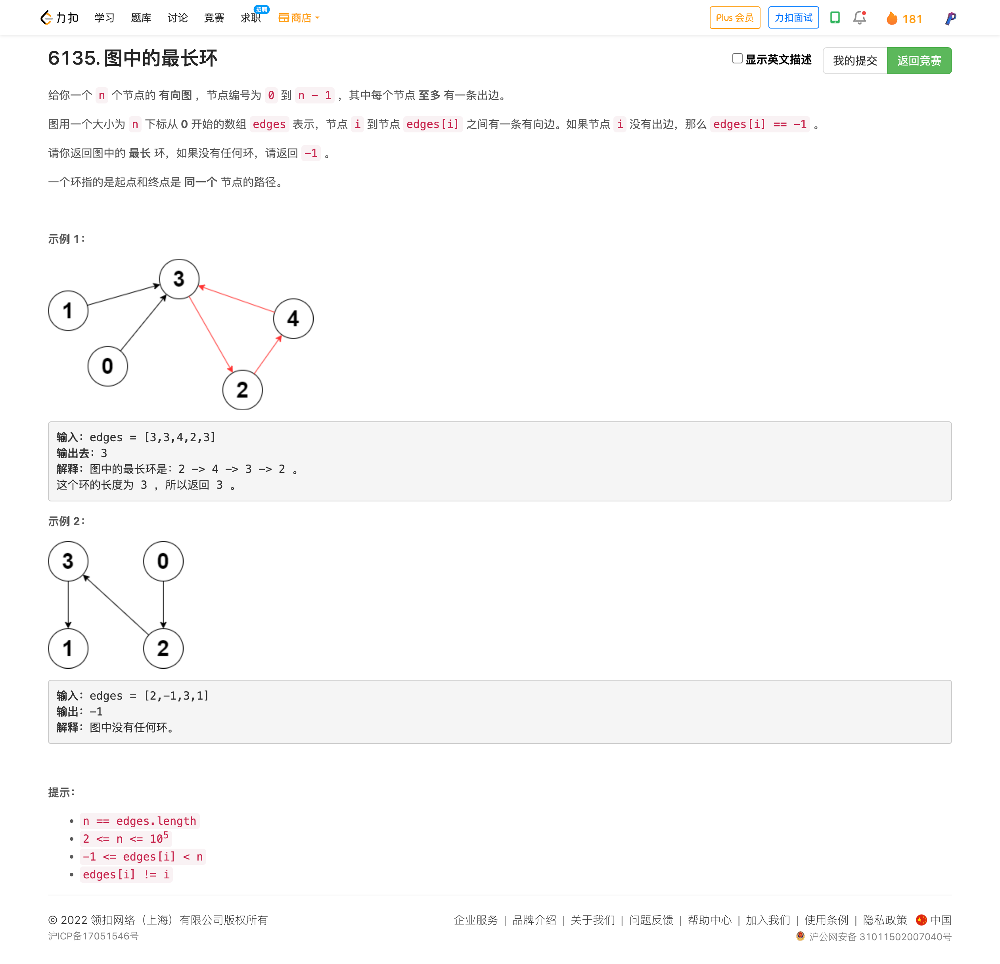

<!-- @import "[TOC]" {cmd="toc" depthFrom=1 depthTo=6 orderedList=false} -->

<!-- code_chunk_output -->

- [6135. 图中的最长环](#6135-图中的最长环)

<!-- /code_chunk_output -->

T4 还是不该如此慢。应记住不要过多调用 STL 容器构造函数。

### 6135. 图中的最长环

