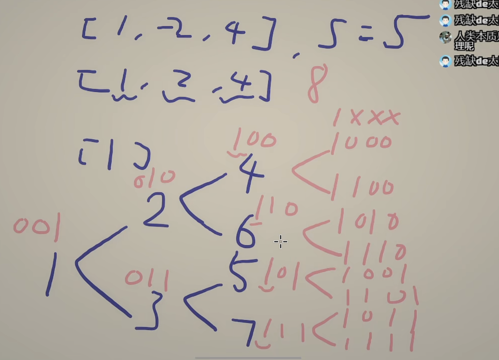

<!-- @import "[TOC]" {cmd="toc" depthFrom=1 depthTo=6 orderedList=false} -->

<!-- code_chunk_output -->

- [6155. 找出数组的第 K 大和（堆/二分+构造第k小的子序列）](#6155-找出数组的第-k-大和堆二分构造第k小的子序列)

<!-- /code_chunk_output -->

T4 思路也不明确。看看到底怎么做。似乎是某个类型的题目。想到了二分（以前似乎有类似题目可做？）；又尝试了堆等等，因为看到 k 值最大也才 2000 ，都不对。这周状态确实不行， T1 就有失误。

### 6155. 找出数组的第 K 大和（堆/二分+构造第k小的子序列）

给你一个整数数组 nums 和一个 正 整数 k 。你可以选择数组的任一 子序列 并且对其全部元素求和。

数组的 第 k 大和 定义为：可以获得的第 k 个 最大 子序列和（子序列和允许出现重复）

返回数组的 第 k 大和 。

子序列是一个可以由其他数组删除某些或不删除元素排生而来的数组，且派生过程不改变剩余元素的顺序。

注意：空子序列的和视作 0 。

示例 1：
```
输入：nums = [2,4,-2], k = 5
输出：2
解释：所有可能获得的子序列和列出如下，按递减顺序排列：
- 6、4、4、2、2、0、0、-2
数组的第 5 大和是 2 。
```

示例 2：
```
输入：nums = [1,-2,3,4,-10,12], k = 16
输出：10
解释：数组的第 16 大和是 10 。
```

提示：
- n == nums.length
- 1 <= n <= 10e5
- -10e9 <= nums[i] <= 10e9
- 1 <= k <= min(2000, 2^n)

实际上比赛时思路和这个一模一样，就是美剧子序列思路没有这个这么简明清晰。参考灵佬画的图。



```cpp
class Solution {
public:
    long long kSum(vector<int> &nums, int k) {
        long sum = 0L;
        for (int &x : nums)
            if (x >= 0) sum += x;
            else x = -x;
        sort(nums.begin(), nums.end());
        priority_queue<pair<long, int>> pq;
        pq.emplace(sum, 0);
        while (--k) {
            auto[sum, i] = pq.top();
            pq.pop();
            if (i < nums.size()) {
                pq.emplace(sum - nums[i], i + 1); // 保留 nums[i-1]
                if (i) pq.emplace(sum - nums[i] + nums[i - 1], i + 1); // 不保留 nums[i-1]，把之前减去的加回来
            }
        }
        return pq.top().first;
    }
};
```

果然也可以用二分做。

```cpp
class Solution {
public:
    long long kSum(vector<int> &nums, int k) {
        long sum = 0L;
        for (int &x : nums) {
            if (x >= 0) sum += x;
            else x = -x;
        }
        sort(nums.begin(), nums.end());

        --k;
        // 二分子序列和，记作 limit，
        // 统计元素和 s 不超过 limit 的子序列个数 cnt。
        auto check = [&](long limit) -> bool {
            int cnt = 0;
            function<void(int, long)> f = [&](int i, long s) {
                if (i == nums.size() || cnt >= k || s + nums[i] > limit) return;
                ++cnt;
                f(i + 1, s + nums[i]); // 选
                f(i + 1, s); // 不选
            };
            f(0, 0L);
            return cnt >= k;
        };
        long left = 0L, right = accumulate(nums.begin(), nums.end(), 0L);
        while (left < right) {
            long mid = (left + right) / 2;
            if (check(mid)) right = mid;
            else left = mid + 1;
        }
        return sum - left;
    }
};
```
