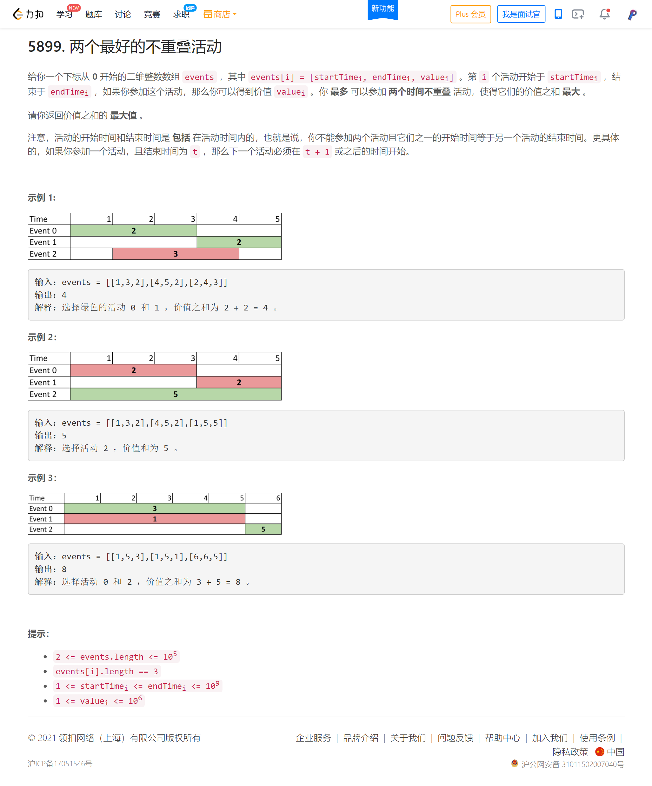
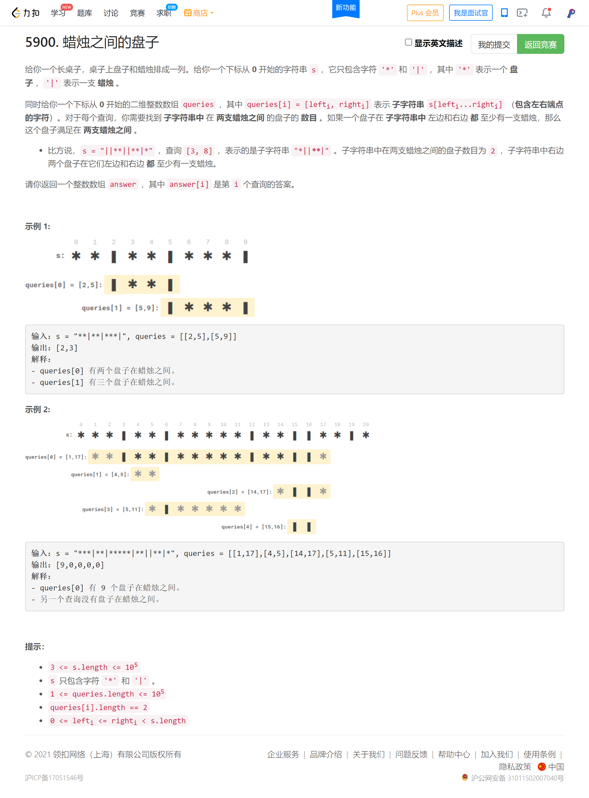
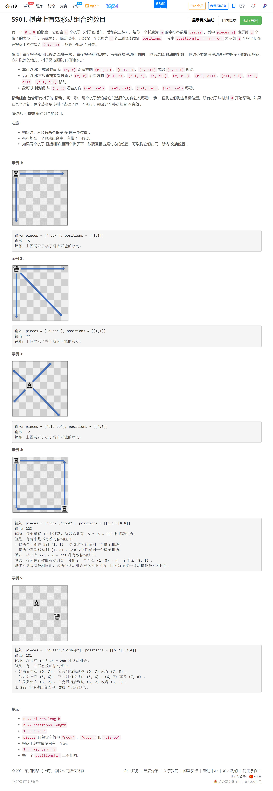

<!-- @import "[TOC]" {cmd="toc" depthFrom=1 depthTo=6 orderedList=false} -->

<!-- code_chunk_output -->

- [两个最好的不重叠活动](#两个最好的不重叠活动)
- [蜡烛之间的盘子（字符串搜索）](#蜡烛之间的盘子字符串搜索)
- [棋盘上有效移动组合的数目](#棋盘上有效移动组合的数目)

<!-- /code_chunk_output -->

迟到了10分钟。

T2 直接没思路。

T3 罚时两次，还是脑中模型不明晰所致。还应加强大脑的训练。

T4 总觉得能做出来，写起来又觉得太麻烦，很累了，遂放弃。

### 两个最好的不重叠活动



```cpp

```

### 蜡烛之间的盘子（字符串搜索）



```cpp
class Solution {
public:
    vector<int> platesBetweenCandles(string s, vector<vector<int>>& queries) {
        int n = s.size();
        vector<int> l(n, -1), r(n, n);
        vector<int> sum(n + 1, 0);

        int near = -1;
        for (int i = 0; i < n; ++ i)
        {
            auto c = s[i];
            l[i] = near;
            if (c == '|') near = i, l[i] = near;  // 这里要更新 l[i]
        }

        near = n;
        for (int i = n-1; i >=0; -- i)
        {
            auto c = s[i];
            r[i] = near;
            if (c == '|') near = i, r[i] = near;
        }
        
        for (int i = 1; i <= n; ++ i)
        {
            if (s[i - 1] == '*') sum[i] = sum[i - 1] + 1;
            else sum[i] = sum[i - 1];
        }

        vector<int> ans;
        for (auto&& q: queries)
        {
            int i = q[0], j = q[1];
            if (i < n && l[i] < q[0]) i = r[i] + 1;  // 直接跳到有栅栏的地方
            if (j >= 0 && r[j] > q[1]) j = l[j] - 1;
            if (i < n && j >= 0) ans.push_back(max(0, sum[j + 1] - sum[i]));
            else ans.push_back(0);
        }

        return ans;
    }
};
```

### 棋盘上有效移动组合的数目


