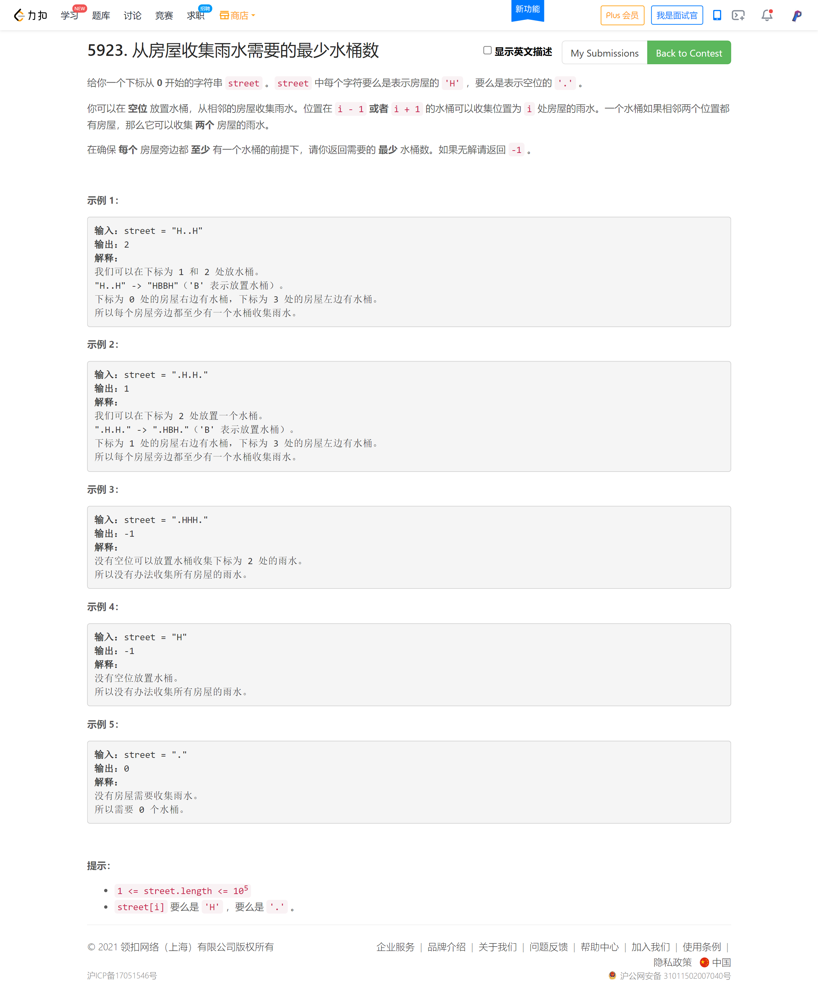
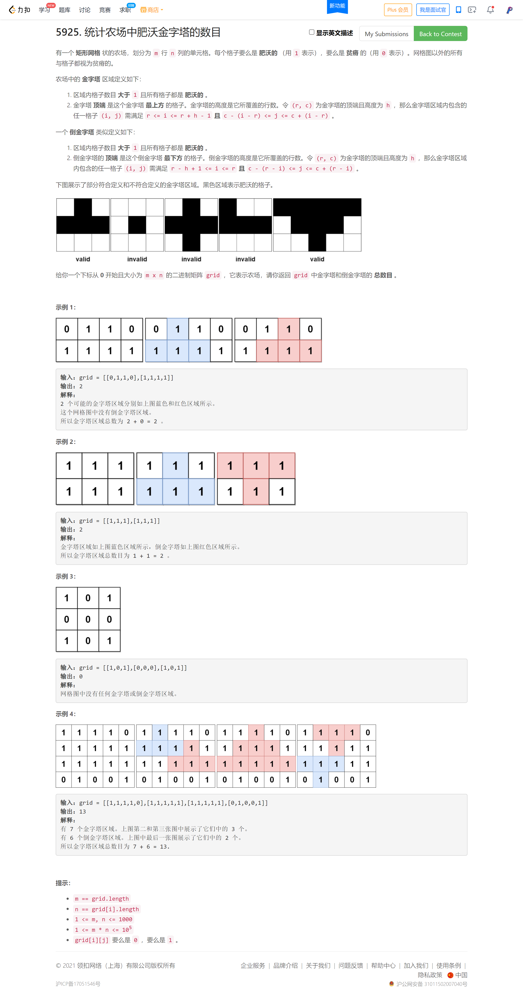
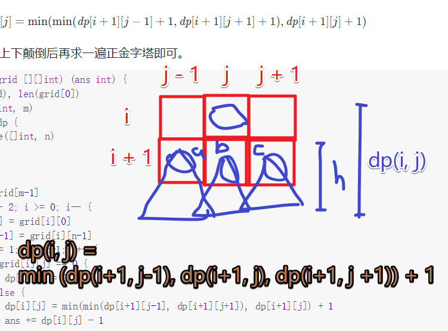

<!-- @import "[TOC]" {cmd="toc" depthFrom=1 depthTo=6 orderedList=false} -->

<!-- code_chunk_output -->

- [从房屋收集雨水需要的最少水桶数（贪心）](#从房屋收集雨水需要的最少水桶数贪心)
- [网格图中机器人回家的最小代价（思维题）](#网格图中机器人回家的最小代价思维题)
- [统计农场中肥沃金字塔的数目（前缀和优化暴力/动态规划）](#统计农场中肥沃金字塔的数目前缀和优化暴力动态规划)

<!-- /code_chunk_output -->

T3 傻了 一道脑筋急转弯，自己心急硬是当成最短路来做，被卡个够呛还 stack-overflow 爆空间。

T4 一言难尽，TLE一次，用二分预处理优化，23:59 再次提交，通过样例从 29/49 到 46/49 还是 TLE ... 明天上午看看大佬们是怎么做的。

### 从房屋收集雨水需要的最少水桶数（贪心）



```cpp
// 我做麻烦了，想看看大佬们什么思路
// 贪心 把 H.H 都去掉，给落单的配水桶
// 还有没配的，就 -1
class Solution {
public:
    int minimumBuckets(string street) {
        int n = street.size();
        
        street = "xxx" + street;
        street = street + "xxx";

        // H.H
        int res = 0;
        int cnt = 0;
        int i = 3;
        while (i < n + 3)
        {
            if (street[i] == '.' && cnt == 1)
                cnt = 2;
            else if (street[i] == 'H' && cnt == 2)
            {
                street[i - 2] = 'x';
                street[i - 1] = 'x';
                street[i - 0] = 'x';
                res ++ ;
                cnt = 0;
            }
            else if (street[i] == 'H' && cnt != 2)
                cnt = 1;
            else cnt = 0;
            ++ i;
        }
        
        // H
        i = 3;
        while (i < n + 3)
        {
            if (street[i - 1] == 'H' && street[i] == '.')
            {
                res ++ ;
                street[i - 1] = 'x';
                street[i]     = 'x';
            }
            else if (street[i + 1] == 'H' && street[i] == '.')
            {
                res ++ ;
                street[i + 1] = 'x';
                street[i]     = 'x';
            }
            ++ i;
        }
        
        i = 3;
        while (i < n + 3)
        {
            if (street[i] == 'H')
            {
                res = -1;
                break;
            }
            ++ i;
        }
        
        return res;
    }
};
```

第二天早上看[linge32](https://leetcode-cn.com/problems/minimum-number-of-buckets-required-to-collect-rainwater-from-houses/solution/cyu-yan-yi-ci-bian-li-by-liu-xiang-3-c1ut/)的思路，自己又写了一个：
- 将放过水桶的位置标记为`'B'`;
- 遇到房屋分情况处理:
  - a 左右已经有木桶; 
  - b 优先放右侧木桶;
  - c 放不了木桶返回`-1`;

```cpp
class Solution {
public:
    int minimumBuckets(string street) {
        int n = street.size();
        int ans = 0;
        for (int i = 0; i < n; ++ i)
        {
            if (street[i] != 'H') continue;
            // 身边已有木桶
            if (i > 0 && street[i - 1] == 'B' || i < n - 1 && street[i + 1] == 'B')
                continue;
            // 优先在右边放木桶
            else if (i < n - 1 && street[i + 1] == '.')
            {
                street[i + 1] = 'B';
                ++ ans;
                continue;
            }
            else if (i > 0 && street[i - 1] == '.')
            {
                street[i - 1] = 'B';
                ++ ans;
                continue;
            }
            else return -1;
        }
        return ans;
    }
};
```

### 网格图中机器人回家的最小代价（思维题）


完全是...陷入刻板思维，着急了。经验不足。

```cpp
class Solution {
public:
    int minCost(vector<int>& startPos, vector<int>& homePos, vector<int>& rowCosts, vector<int>& colCosts) {
        int x = startPos[0], y = startPos[1];
        int a = homePos[0], b = homePos[1];

        int ans = 0;
        while (x < a) ans += rowCosts[++ x];
        while (x > a) ans += rowCosts[-- x];
        while (y < b) ans += colCosts[++ y];
        while (y > b) ans += colCosts[-- y];
        return ans;
    }
};
```

### 统计农场中肥沃金字塔的数目（前缀和优化暴力/动态规划）



```cpp
// 很直观的思路然后 TLE
// 比赛时已经尽力做了优化
class Solution {
public:
    int countPyramids(vector<vector<int>>& grid) {
        int res = 0;
        
        int n = grid.size();
        int m = grid[0].size();
        
        int f[n][m][m];
        memset(f, 1, sizeof f);
        for (int h = 0; h < n; ++ h)
        {
            multiset<int> hash;
            for (int i = 0; i < m; ++ i)
                if (grid[h][i] == 0) hash.insert(i);
            for (int i = 0; i < m - 1; ++ i)
                for (int j = i + 1; j < m; ++ j)
                {
                    if (grid[h][i] == 0)
                    {
                        f[h][i][j] = 0;
                        continue;
                    }
                    auto it = hash.upper_bound(i);
                    cout << h << " " << *it << endl;
                    if (it != hash.end() && *it <= j)
                    {
                        cout << h << " " << i << " " << j << endl;
                        f[h][i][j] = 0;
                    }
                }
        }
        
        auto findDown = [&](int x, int y) -> void
        {
            int lx = x, ly = y, rx = x, ry = y;
            while (true)
            {
                lx = lx + 1, ly = ly - 1;
                rx = rx + 1, ry = ry + 1;
                if (lx >= n || ly < 0 || rx >= n || ry >= m) return ;
                if (!f[lx][ly][ry]) return ;
                // for (int i = ly; i <= ry; ++ i)
                //     if (!grid[lx][i]) return ;
                res ++ ;
            }
        };
        
        auto findUp = [&](int x, int y) -> void
        {
            int lx = x, ly = y, rx = x, ry = y;
            while (true)
            {
                lx = lx - 1, ly = ly - 1;
                rx = rx - 1, ry = ry + 1;
                if (lx < 0 || ly < 0 || rx < 0 || ry >= m) return ;
                if (!f[lx][ly][ry]) return ;
                // for (int i = ly; i <= ry; ++ i)
                //     if (!grid[lx][i]) return ;
                res ++ ;
            }
        };
        
        for (int i = 0; i < n; ++ i)
            for (int j = 0; j < m; ++ j)
                if (grid[i][j])
                {
                    findUp(i, j);
                    findDown(i, j);
                }
        
        return res;
    }
};
```

不聪明！

首先参考[坑神](https://www.bilibili.com/video/BV1LS4y1X7tC?p=5)的方法：
- 和我一样是暴力，只不过用前缀和判断
- 如果 `y1 - y2 + 1` 等于 `[y1, y2]` 和
- 则 `y1` 到 `y2` 一定都是肥沃土地

```cpp
class Solution {
public:
    int countPyramids(vector<vector<int>>& grid) {
        int res = 0;
        
        int n = grid.size();
        int m = grid[0].size();
        
        int s[n][m + 1];
        memset(s, 0, sizeof s);
        for (int i = 0; i < n; ++ i)
            for (int j = 0; j < m; ++ j)
                s[i][j + 1] = s[i][j] + grid[i][j];

        auto findDown = [&](int x, int y) -> void
        {
            int lx = x, ly = y, rx = x, ry = y;
            while (true)
            {
                lx = lx + 1, ly = ly - 1;
                rx = rx + 1, ry = ry + 1;
                if (lx >= n || ly < 0 || rx >= n || ry >= m) return ;
                if (ry - ly + 1 != s[lx][ry + 1] - s[lx][ly]) return ;
                res ++ ;
            }
        };
        
        auto findUp = [&](int x, int y) -> void
        {
            int lx = x, ly = y, rx = x, ry = y;
            while (true)
            {
                lx = lx - 1, ly = ly - 1;
                rx = rx - 1, ry = ry + 1;
                if (lx < 0 || ly < 0 || rx < 0 || ry >= m) return ;
                if (ry - ly + 1 != s[lx][ry + 1] - s[lx][ly]) return ;
                res ++ ;
            }
        };
        
        for (int i = 0; i < n; ++ i)
            for (int j = 0; j < m; ++ j)
                if (grid[i][j])
                {
                    findUp(i, j);
                    findDown(i, j);
                }
        
        return res;
    }
};
```

巨佬 [灵茶山艾府](https://leetcode-cn.com/problems/count-fertile-pyramids-in-a-land/solution/dong-tai-gui-hua-by-endlesscheng-depp/) 的动态规划太妙了：

先求正金字塔。

定义 $\textit{dp}[i][j]$ 表示金字塔顶端位于 $(i,j)$ 时的最大层数（$1$ 层也算）。如果顶端在 $(i,j)$ 的金字塔最大能有 $x$ 层，那么顶端在 $(i,j)$ 的金字塔也可以有 $x-1,x-2,\cdots,1$ 层。由于要求区域内格子数目大于 $1$，统计答案的时候把 $1$ 层去掉，因此有 $x-1$ 个以 $(i,j)$ 为顶端的金字塔。

我们从 $\textit{grid}$ 的最后一行开始往上递推。转移的策略是在 $(i+1,j)$ 处的最大金字塔上套一层倒 V 型的「外壳」。具体来说，从 $(i,j)$ 出发向左下方向前进，求出能达到的最长连续 11 的个数，根据 $\textit{dp}$ 的定义，这就是 $\textit{dp}[i+1][j-1]+1$；同理，向右下方向前进，能达到的最长连续 $1$ 的个数为 $\textit{dp}[i+1][j+1]+1$。取左右最长连续 $1$ 的个数的最小值即为「外壳」的高度。那么 $(i,j)$ 处的最大金字塔的高度为「外壳」的高度与 $(i+1,j)$ 处最大金字塔高度 $+1$ 的最小值。

即

$$\textit{dp}[i][j] = \min(\min(\textit{dp}[i+1][j-1]+1, \textit{dp}[i+1][j+1]+1), \textit{dp}[i+1][j]+1)$$

倒金字塔可以将 $\textit{grid}$ 上下颠倒后再求一遍正金字塔即可。



```cpp
class Solution {
public:
    int countPyramids(vector<vector<int>>& grid) {
        int n = grid.size();
        int m = grid[0].size();

        int f[n][m];
        memset(f, 0, sizeof f);

        int ans = 0;

        auto dp = [&]()
        {
            for (int i = 0; i < m; ++ i)
                f[n - 1][i] = grid[n - 1][i];
            for (int i = n - 2; i >= 0; -- i)
            {
                f[i][0] = grid[i][0];
                f[i][m - 1] = grid[i][m - 1];
                for (int j = 1; j < m - 1; ++ j)
                    if (grid[i][j] == 0) f[i][j] = 0;
                    else
                    {
                        f[i][j] = min(min(f[i + 1][j - 1], f[i + 1][j + 1]), f[i + 1][j]) + 1;
                        ans += f[i][j] - 1;
                    }
            }
        };

        dp();
        for (int i = 0; i < n / 2; ++ i)
            for (int j = 0; j < m; ++ j)
                swap(grid[i][j], grid[n - 1 - i][j]);
        dp();

        return ans;
    }
};
```
