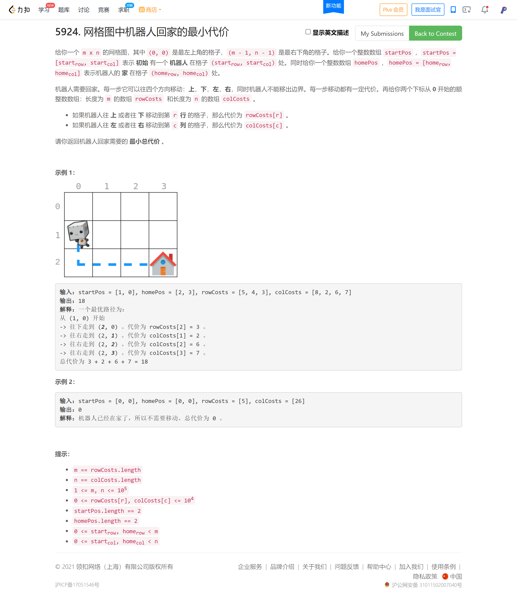

<!-- @import "[TOC]" {cmd="toc" depthFrom=1 depthTo=6 orderedList=false} -->

<!-- code_chunk_output -->

- [从房屋收集雨水需要的最少水桶数（贪心）](#从房屋收集雨水需要的最少水桶数贪心)
- [网格图中机器人回家的最小代价（思维题）](#网格图中机器人回家的最小代价思维题)
- [统计农场中肥沃金字塔的数目](#统计农场中肥沃金字塔的数目)

<!-- /code_chunk_output -->

T3 傻了 一道脑筋急转弯，自己心急硬是当成最短路来做，被卡个够呛还 stack-overflow 爆空间。

T4 一言难尽，TLE一次，用二分预处理优化，23:59 再次提交，通过样例从 29/49 到 46/49 还是 TLE ... 明天上午看看大佬们是怎么做的。

### 从房屋收集雨水需要的最少水桶数（贪心）


```cpp
// 我做麻烦了，想看看大佬们什么思路
// 贪心 把 H.H 都去掉，给落单的配水桶
// 还有没配的，就 -1
class Solution {
public:
    int minimumBuckets(string street) {
        int n = street.size();
        
        street = "xxx" + street;
        street = street + "xxx";

        // H.H
        int res = 0;
        int cnt = 0;
        int i = 3;
        while (i < n + 3)
        {
            if (street[i] == '.' && cnt == 1)
                cnt = 2;
            else if (street[i] == 'H' && cnt == 2)
            {
                street[i - 2] = 'x';
                street[i - 1] = 'x';
                street[i - 0] = 'x';
                res ++ ;
                cnt = 0;
            }
            else if (street[i] == 'H' && cnt != 2)
                cnt = 1;
            else cnt = 0;
            ++ i;
        }
        
        // H
        i = 3;
        while (i < n + 3)
        {
            if (street[i - 1] == 'H' && street[i] == '.')
            {
                res ++ ;
                street[i - 1] = 'x';
                street[i]     = 'x';
            }
            else if (street[i + 1] == 'H' && street[i] == '.')
            {
                res ++ ;
                street[i + 1] = 'x';
                street[i]     = 'x';
            }
            ++ i;
        }
        
        i = 3;
        while (i < n + 3)
        {
            if (street[i] == 'H')
            {
                res = -1;
                break;
            }
            ++ i;
        }
        
        return res;
    }
};
```

### 网格图中机器人回家的最小代价（思维题）



### 统计农场中肥沃金字塔的数目


```cpp
// 很直观的思路然后 TLE
// 比赛时已经尽力做了优化
class Solution {
public:
    int countPyramids(vector<vector<int>>& grid) {
        int res = 0;
        
        int n = grid.size();
        int m = grid[0].size();
        
        int f[n][m][m];
        memset(f, 1, sizeof f);
        for (int h = 0; h < n; ++ h)
        {
            multiset<int> hash;
            for (int i = 0; i < m; ++ i)
                if (grid[h][i] == 0) hash.insert(i);
            for (int i = 0; i < m - 1; ++ i)
                for (int j = i + 1; j < m; ++ j)
                {
                    if (grid[h][i] == 0)
                    {
                        f[h][i][j] = 0;
                        continue;
                    }
                    auto it = hash.upper_bound(i);
                    cout << h << " " << *it << endl;
                    if (it != hash.end() && *it <= j)
                    {
                        cout << h << " " << i << " " << j << endl;
                        f[h][i][j] = 0;
                    }
                }
        }
        
        auto findDown = [&](int x, int y) -> void
        {
            int lx = x, ly = y, rx = x, ry = y;
            while (true)
            {
                lx = lx + 1, ly = ly - 1;
                rx = rx + 1, ry = ry + 1;
                if (lx >= n || ly < 0 || rx >= n || ry >= m) return ;
                if (!f[lx][ly][ry]) return ;
                // for (int i = ly; i <= ry; ++ i)
                //     if (!grid[lx][i]) return ;
                res ++ ;
            }
        };
        
        auto findUp = [&](int x, int y) -> void
        {
            int lx = x, ly = y, rx = x, ry = y;
            while (true)
            {
                lx = lx - 1, ly = ly - 1;
                rx = rx - 1, ry = ry + 1;
                if (lx < 0 || ly < 0 || rx < 0 || ry >= m) return ;
                if (!f[lx][ly][ry]) return ;
                // for (int i = ly; i <= ry; ++ i)
                //     if (!grid[lx][i]) return ;
                res ++ ;
            }
        };
        
        for (int i = 0; i < n; ++ i)
            for (int j = 0; j < m; ++ j)
                if (grid[i][j])
                {
                    findUp(i, j);
                    findDown(i, j);
                }
        
        return res;
    }
};
```
