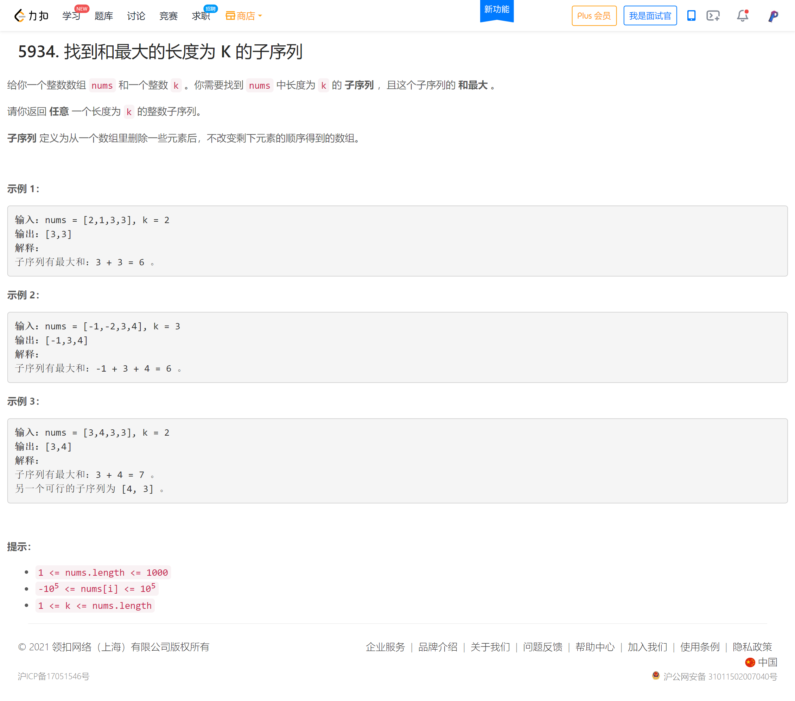
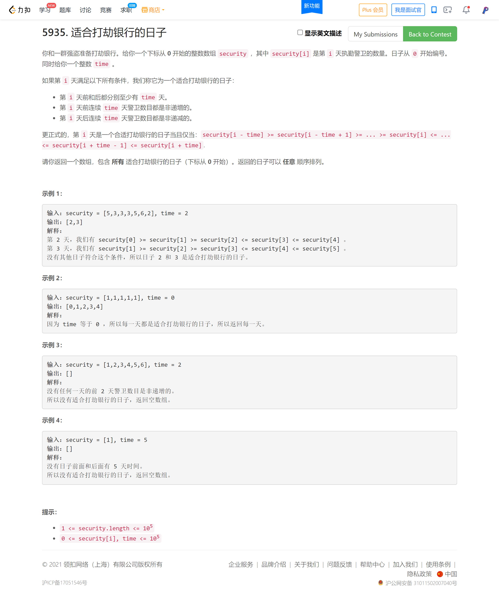
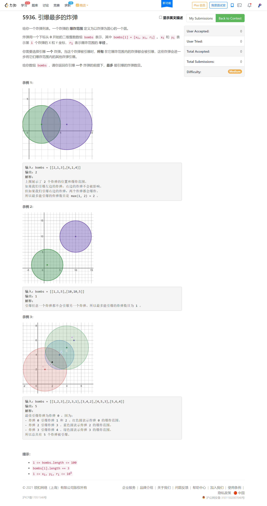
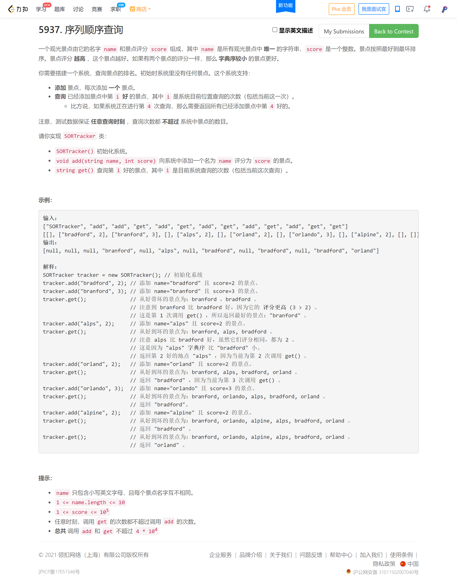

<!-- @import "[TOC]" {cmd="toc" depthFrom=1 depthTo=6 orderedList=false} -->

<!-- code_chunk_output -->

- [5934. 找到和最大的长度为 K 的子序列（两次排序）](#5934-找到和最大的长度为-k-的子序列两次排序)
- [5935. 适合打劫银行的日子](#5935-适合打劫银行的日子)
- [5936. 引爆最多的炸弹](#5936-引爆最多的炸弹)
- [5937. 序列顺序查询](#5937-序列顺序查询)

<!-- /code_chunk_output -->

第一题排列组合没思路，累了，这次不比了。

第一题根本不是排列组合，我现在思维总是陷入复杂困境，包括周赛 271 也是，第二题竟然多花了半个小时来想（第四题昨晚再回头来想），其实就是二重遍历，完全简单问题复杂化了。

### 5934. 找到和最大的长度为 K 的子序列（两次排序）



考试时时候思维死板了，只想到 `dfs` 求排列数，估计是太多 `vector` 复制操作导致超时了：把 `vector` 改成引用调用、并且多多用 `move` 等操作会好很多的吧！

```cpp
class Solution {
public:
    vector<int> maxSubsequence(vector<int>& nums, int k) {
        int n = nums.size();
        int maxv = INT_MIN;
        vector<int> res;
        function<void(int, vector<int>)> dfs = [&](int u, vector<int> s) -> void
        {
            if (s.size() == k)
            {
                if (accumulate(s.begin(), s.end(), 0) > maxv)
                {
                    maxv = accumulate(s.begin(), s.end(), 0);
                    res = s;
                }
                return ;
            }
            
            if (u >= n) return ;

            for (int i = u; i < n; ++ i)
            {
                dfs(i + 1, s);
                s.push_back(nums[i]);
                dfs(i + 1, s);
            }
        };
        
        dfs(0, {});
        
        return res;
    }
};
```

上述代码 TLE 了。9 / 48 个通过测试用例。

读完侯捷老师的《STL源码剖析》应该会通透很多。

以下是简单做法。

```cpp
class Solution {
public:
    vector<int> maxSubsequence(vector<int>& nums, int k) {
        // 就是找前 k 个，然后再根据索引排序，防止顺序变了
        int n = nums.size();
        vector<pair<int, int>> p;
        for (int i = 0; i < n; ++ i)
            p.push_back({i, nums[i]});
        // 根据数值排序
        sort(p.begin(), p.end(), [](auto a, auto b) {
            return a.second > b.second;
        });
        // 取前 k 个最大的，根据索引排序
        sort(p.begin(), p.begin() + k);
        vector<int> res;
        for (int i = 0; i < k; ++ i) res.push_back(p[i].second);
        return res;
    }
};
```

### 5935. 适合打劫银行的日子



```cpp

```

### 5936. 引爆最多的炸弹



```cpp

```

### 5937. 序列顺序查询



```cpp

```
