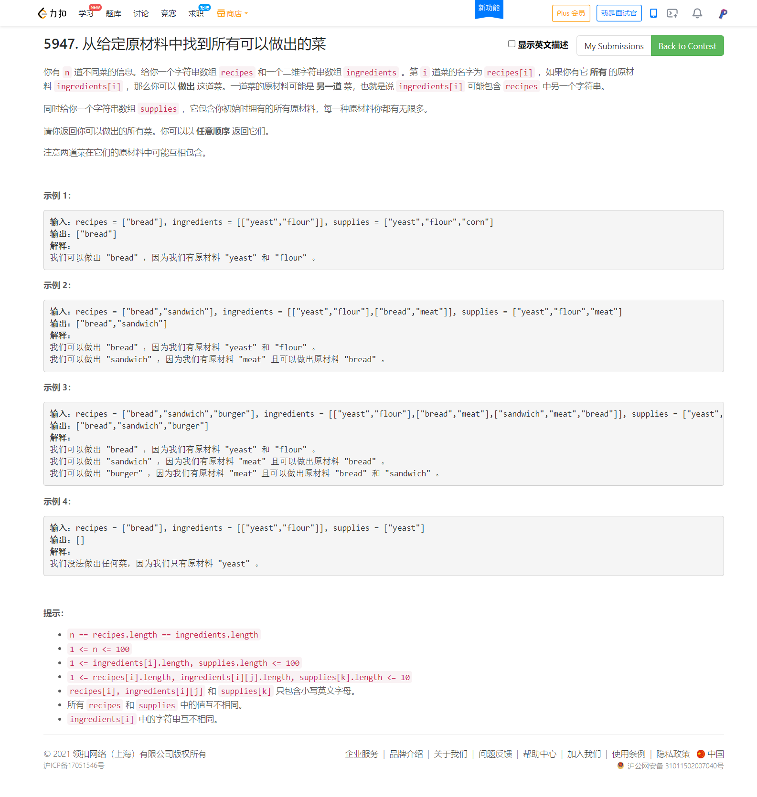
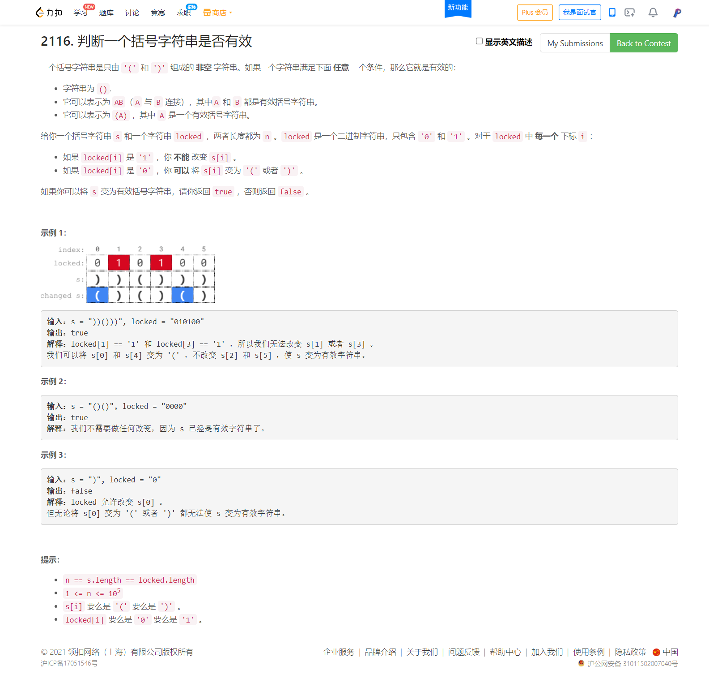
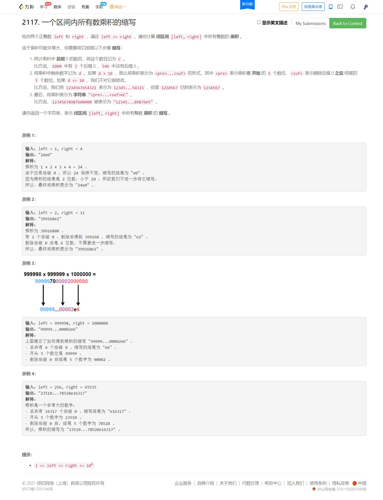

<!-- @import "[TOC]" {cmd="toc" depthFrom=1 depthTo=6 orderedList=false} -->

<!-- code_chunk_output -->

- [5947. 从给定原材料中找到所有可以做出的菜（拓扑排序）](#5947-从给定原材料中找到所有可以做出的菜拓扑排序)
- [2116. 判断一个括号字符串是否有效（括号问题经典技巧，遍历求平衡度）](#2116-判断一个括号字符串是否有效括号问题经典技巧遍历求平衡度)
- [2117. 一个区间内所有数乘积的缩写（数学）](#2117-一个区间内所有数乘积的缩写数学)

<!-- /code_chunk_output -->

没参加。

### 5947. 从给定原材料中找到所有可以做出的菜（拓扑排序）



```cpp
class Solution {
public:
    vector<string> findAllRecipes(vector<string>& recipes, vector<vector<string>>& ingredients, vector<string>& supplies) {
        unordered_map<string, vector<string>> g;  // 指向
        unordered_map<string, int> cnt;  // 入度
        for (int i = 0; i < recipes.size(); ++ i)
        {
            for (int j = 0; j < ingredients[i].size(); ++ j)
                g[ingredients[i][j]].push_back(recipes[i]);
            cnt[recipes[i]] = ingredients[i].size();
        }

        vector<string> ans;
        queue<string> q;
        for (auto&& s: supplies) q.push(s);

        while (q.size())
        {
            string s = q.front();
            q.pop();
            for (auto&& rec: g[s])
            {
                -- cnt[rec];
                if (cnt[rec] == 0)
                {
                    ans.push_back(rec);
                    q.push(rec);
                }
            }
        }

        return ans;
    }
};
```

### 2116. 判断一个括号字符串是否有效（括号问题经典技巧，遍历求平衡度）



```cpp
class Solution {
public:
    bool canBeValid(string s, string locked) {
        int n = s.size();
        if (n & 1) return false;

        int cnt = 0;  // 平衡度
        // 正着遍历保证了 ) 左边都有能匹配的
        for (int i = 0; i < n; ++ i)
        {
            if (s[i] == '(' || locked[i] == '0')
                ++ cnt;
            else if (cnt > 0)
                -- cnt;
            else return false;
        }

        /**
        * 灵茶山艾府：
        * 如果遍历结束后还剩下可变括号，可以将其与其他可变括号配对，或者与剩下的左括号配对。
        * 这种配对方式可以让最终的平衡度等于 0 。但是这种做法会漏掉左括号比右括号多的情况，
        * 因为这种情况下我们是无法区分 *( 和 *( 的，这里 * 表示可变括号，
        * 所以我们还需要反着再遍历一次，从而涵盖所有情况。
        */

        // 反着遍历保证了 ( 右边都有能匹配的
        cnt = 0;
        for (int i = n - 1; i >= 0; -- i)
        {
            if (s[i] == ')' || locked[i] == '0')
                ++ cnt;
            else if (cnt > 0)
                -- cnt;
            else return false;
        }

        return true;
    }
};
```

### 2117. 一个区间内所有数乘积的缩写（数学）



大量参考[灵茶山艾府](https://leetcode-cn.com/problems/abbreviating-the-product-of-a-range/solution/chai-fen-cheng-si-ge-wen-ti-ji-suan-dui-6karq/)以及[jmy45](https://leetcode-cn.com/u/jmy-9/)老哥。

将原问题拆分成如下四个问题：

- 计算 $\textit{pre}$；
- 计算 $\textit{suf}$；
- 计算 $C$；
- 判断剩余数字的长度是否超过 $10$。

**计算 $\textit{pre}$：**

我们可以通过取以 $10$ 为底的对数的方式，将乘法转换成加法，即如下法则：

$$a\cdot b = 10^{\log_{10}a}\cdot 10^{\log_{10}b} = 10^{\log_{10}a+\log_{10}b}$$

记最后得到的指数为 $e$，则有

$$\textit{pre} = \lfloor10^{e-\lfloor e \rfloor} \cdot 10000\rfloor = \lfloor10^{e-\lfloor e \rfloor + 4}\rfloor$$

**计算 $C$：**

先来看怎么计算尾零。这相当于求乘积中能分解出来的 $10$ 的个数。

由于 $10=2\cdot 5$，我们可以将所有整数分解质因子，那么分解出来的 $2$ 的幂次之和，以及 $5$ 的幂次之和，这两者的较小值就是最后乘积中能分解出来的 $10$ 的个数。

**计算 $\textit{suf}$：**

我们可以将每个数字的所有因子 $2$ 和 $5$ 去掉，然后将剩下的数字相乘，由于我们只取末 $5$ 位，所以在乘法的过程中需要对 $10^5$ 取模。

由于可能会多去掉一些 $2$ 或 $5$，在遍历 $[\textit{left},\textit{right}]$ 结束后还需要再重新乘上多去掉的 $2$ 或 $5$。

**判断剩余数字的长度是否超过 $10$:**

在上一条的计算过程中额外计算一个乘积 $\textit{mul}$，判断其是否会大于或等于 $10^{10}$。

```go
func abbreviateProduct(left, right int) string {
    e, cnt2, cnt5, suf, mul := 0.0, 0, 0, 1, 1
    update := func(x int) {
        suf = suf * x % 1e5
        if mul != -1 {
            mul *= x
            if mul >= 1e10 { // 长度超过 10
                mul = -1
            }
        }
    }

    for i := left; i <= right; i++ {
        e += math.Log10(float64(i))
        x := i
        tz := bits.TrailingZeros(uint(x)) // 因子 2 的个数
        cnt2 += tz
        x >>= tz
        for ; x%5 == 0; x /= 5 {
            cnt5++ // 因子 5 的个数
        }
        update(x)
    }
    cnt10 := min(cnt2, cnt5)
    for i := cnt10; i < cnt2; i++ {
        update(2) // 补上多拆出来的 2
    }
    for i := cnt10; i < cnt5; i++ {
        update(5) // 补上多拆出来的 5
    }

    if mul != -1 { // 不需要缩写
        return fmt.Sprintf("%de%d", mul, cnt10)
    }
    pre := int(math.Pow(10, e-math.Floor(e)+4))
    return fmt.Sprintf("%d...%05de%d", pre, suf, cnt10)
}

func min(a, b int) int { if a > b { return b }; return a }
```

然而上述解法并不能通过 [@hqztrue](https://leetcode-cn.com/u/hqztrue/) 给出的数据。

将计算 $\textit{pre}$ 的部分换成了高精度的写法。直接对每个数相乘，超过一定位数就截断。

```go
var lim, _ = new(big.Int).SetString(strings.Repeat("9", 200), 10)
var div, _ = new(big.Int).SetString("1"+strings.Repeat("0", 100), 10)

func abbreviateProduct(left, right int) string {
    cnt2, cnt5, suf, mul := 0, 0, 1, 1
    update := func(x int) {
        suf = suf * x % 1e5
        if mul != -1 {
            mul *= x
            if mul >= 1e10 { // 长度超过 10
                mul = -1
            }
        }
    }

    pre := big.NewInt(1)
    for i := left; i <= right; i++ {
        pre.Mul(pre, big.NewInt(int64(i)))
        if pre.Cmp(lim) > 0 { // 超过一定位数就截断
            pre.Quo(pre, div)
        }
        x := i
        tz := bits.TrailingZeros(uint(x)) // 因子 2 的个数
        cnt2 += tz
        x >>= tz
        for ; x%5 == 0; x /= 5 {
            cnt5++ // 因子 5 的个数
        }
        update(x)
    }
    cnt10 := min(cnt2, cnt5)
    for i := cnt10; i < cnt2; i++ {
        update(2) // 补上多拆出来的 2
    }
    for i := cnt10; i < cnt5; i++ {
        update(5) // 补上多拆出来的 5
    }

    if mul != -1 { // 不需要缩写
        return fmt.Sprintf("%de%d", mul, cnt10)
    }
    return fmt.Sprintf("%s...%05de%d", pre.String()[:5], suf, cnt10)
}

func min(a, b int) int { if a > b { return b }; return a }
```

C++ 版本：

```cpp
class Solution {
public:
    string abbreviateProduct(int left, int right) {
        __uint128_t pre=1;
        long long suf=1,mul=1;
        auto update=[&](int x){
            suf=suf*x%int(1e5);
            if (mul!=-1){
                mul*=x;
                if (mul>=1e10)
                    mul=-1;
            } 
        };
        int cnt2=0,cnt5=0;
        for (int i=left;i<=right;i++){
            pre*=i;
            int last=0;
            while (pre>=1e23) {last=pre%10;pre/=10;}
            if (last>=5)
                pre++;
            int x=i;
            for (;x%2==0;x/=2)
                cnt2++;
            for (;x%5==0;x/=5)
                cnt5++;
            update(x);
        }
        int cnt10=min(cnt2,cnt5);
        for (int i=cnt10;i<cnt2;i++)
            update(2);
        for (int i=cnt10;i<cnt5;i++)
            update(5);
        if (mul!=-1)
            return to_string(mul)+"e"+to_string(cnt10);
        while (pre>=1e5) pre/=10;
        int p=pre;
        string suff=to_string(suf);
        while (suff.size()<5) suff="0"+suff;
        return to_string(p)+"..."+suff+"e"+to_string(cnt10);
    }
};
```
