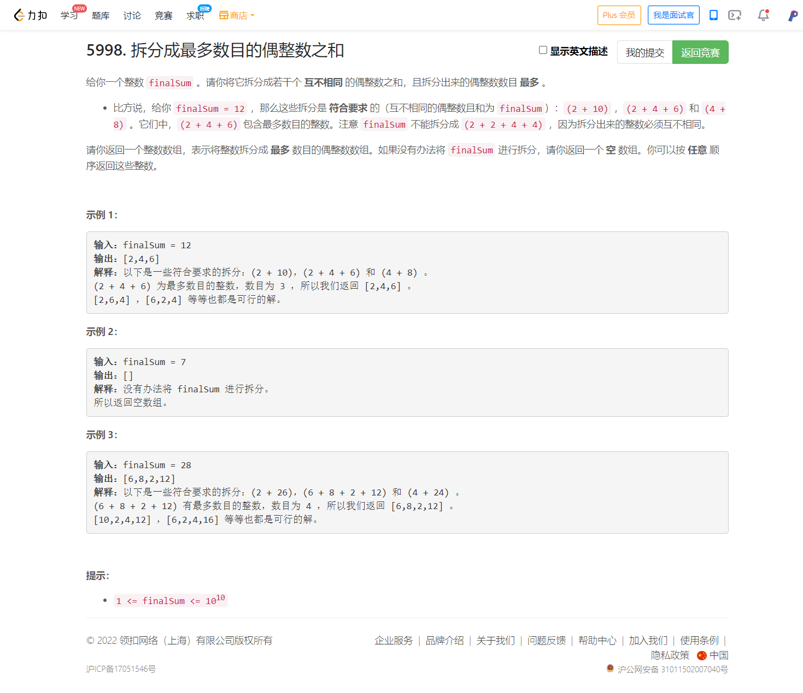
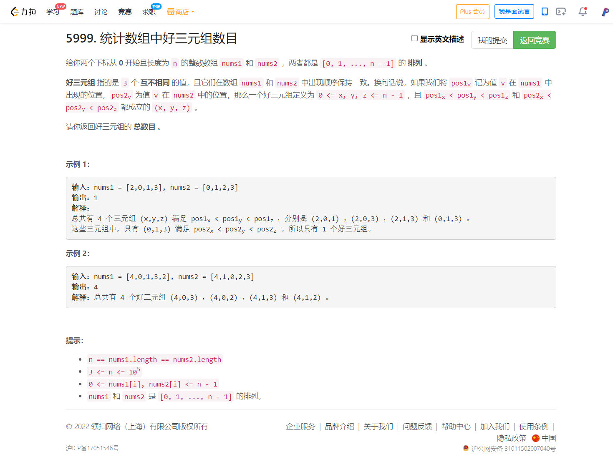

<!-- @import "[TOC]" {cmd="toc" depthFrom=1 depthTo=6 orderedList=false} -->

<!-- code_chunk_output -->

- [5998. 拆分成最多数目的偶整数之和（贪心）](#5998-拆分成最多数目的偶整数之和贪心)
- [5999. 统计数组中好三元组数目（坐标映射+树状数组）](#5999-统计数组中好三元组数目坐标映射树状数组)

<!-- /code_chunk_output -->

T3 是贪心，怪我没有大胆做下去，直到考试最后一刻才尝试了一下。

T4 不会，想了很久。似乎是线段数组，但是我没有学过。

### 5998. 拆分成最多数目的偶整数之和（贪心）



贪心就行，为什么合理？

反证法：假设最优解没有 2 ，那么我对最优解进行改造，一定可以把最优解中的最大数减去 2 ，然后给解中加入一个 2 ；如果最优解中`最大数 - 2 == 次大数`，那么我们存在 2 的解中将最大数转换为 `最大数 + 次大数 - 2` ，此时解中元素数量与最优解相等；如果最优解中 `最大数 - 2 != 次大数` ，则说明我们构造出的解一定大于最优解，因此在此情况下最优解中没有 2 这个结论矛盾。

综上，一定存在一种解其中包含 2 ，并且大于等于其他解的值。 4 、 6 等可以递推证明。

```cpp
class Solution {
public:
    vector<long long> maximumEvenSplit(long long finalSum) {
        if (finalSum % 2) return {};
        vector<long long> res;
        for (long long i = 2; i <= finalSum; i += 2)
        {
            res.push_back(i);
            finalSum -= i;
        }
        res[res.size() - 1] += finalSum;
        return res;
    }
};
```

### 5999. 统计数组中好三元组数目（坐标映射+树状数组）



```cpp
class Solution {
public:
    long long goodTriplets(vector<int>& nums1, vector<int>& nums2) {
        /**
         * 首先，数字的大小在这里意义不大，只是用来标明每个数字身份是独特的
         * 取值范围为 [0, n-1] 因此可以把 nums1 映射成 [0, 1, ..., n-1]
         * 根据这个映射，再把 nums2 给映射转换了
         * 此时， nums2 中数值的大小，就是对应数字在 nums1 中的位置
         * 因此对于 nums2 的任何一个数 y ， ans += 左边比 y 小的 * 右边比 y 大的
         * 用什么数据结构来求呢？树状数组、线段树都行
         */
        int n = nums1.size();
        int P[n], T[n+1];
        for (int i = 0; i < n; ++ i) P[nums1[i]] = i;
        memset(T, 0, sizeof T);
        long long ans = 0;
        for (int i = 0; i < n; ++ i)
        {
            int y = P[nums2[i]];
            // 树状数组表示比 y 小的值有多少个了
            // 更新树状数组，注意树状数组下标从 1 开始
            for (int j = y + 1; j < n + 1; j += j & -j) T[j] ++ ;
            // 计算 y 对应的答案
            long long l = 0, r;
            for (int j = y; j; j -= j & -j) l += (long long) T[j];
            r = (long long) n - 1 - y - (i - l);  // 比 y 大的减去左边比 y 大的
            ans += l * r;
        }
        return ans;
    }
};
```
