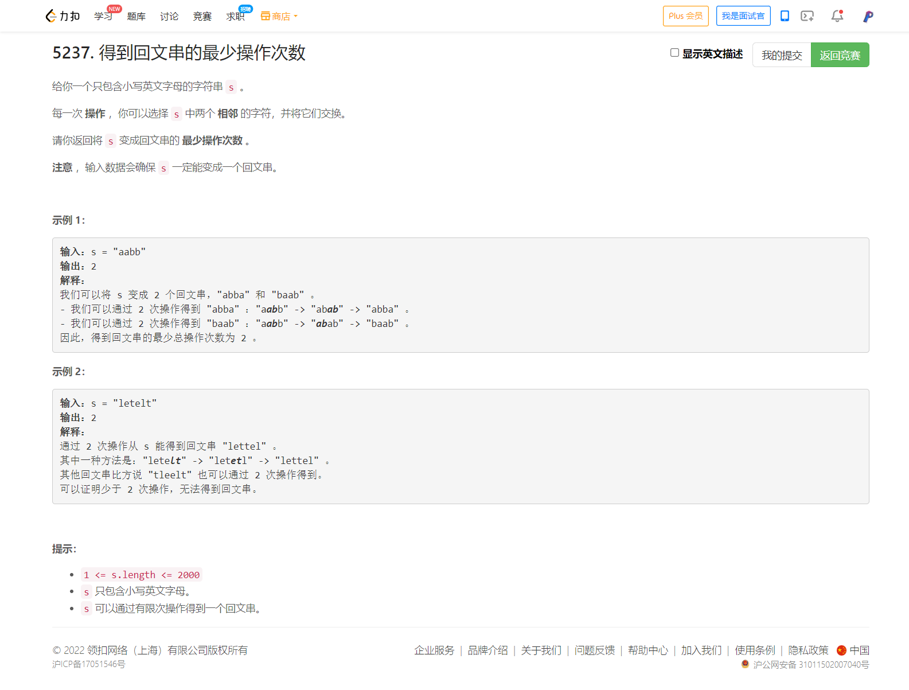

<!-- @import "[TOC]" {cmd="toc" depthFrom=1 depthTo=6 orderedList=false} -->

<!-- code_chunk_output -->

- [5237. 得到回文串的最少操作次数（贪心+暴力解决简单版求回文串问题/困难版是在求逆序对）](#5237-得到回文串的最少操作次数贪心暴力解决简单版求回文串问题困难版是在求逆序对)

<!-- /code_chunk_output -->

#### 5237. 得到回文串的最少操作次数（贪心+暴力解决简单版求回文串问题/困难版是在求逆序对）



这里主要参考 [tsreaper](https://leetcode-cn.com/problems/minimum-number-of-moves-to-make-palindrome/solution/tan-xin-zheng-ming-geng-da-shu-ju-fan-we-h57i/)

贪心的证明可以理解为各种相对位置的讨论（`xxyy` `xyxy` `xyyx`）。此题数据范围只有 2000 因此可以暴力贪心。更大的数据范围 `1e5` 通过双端队列维护每个字母出现的位置，并用树状数组维护哪些位置的字母已经被交换出去。复杂度 $\mathcal{O}(n\log n)$ 。这里我没有深究。

原题（困难版）：
- Distorted Palindrome https://www.codechef.com/problems/ENCD12
- P5041 [HAOI2009]求回文串 https://www.luogu.com.cn/problem/P5041

```cpp
// 贪心，用最左边的字符，找最靠右的同一个字符，然后移到对称的位置上去
// 缩小问题，重复这一步骤
class Solution {
public:
    int minMovesToMakePalindrome(string s) {
        int n = s.size(), ans = 0;
        for (int i = 0, j = n - 1; i < n / 2; ++ i)
        {
            bool found = false;
            for (int k = j; i != k; -- k)
                // 贪心，找到了最靠右边的、没被匹配的字符
                if (s[i] == s[k])
                {
                    found = true;
                    while (k < j)
                    {
                        swap(s[k], s[k + 1]);
                        ++ k;
                        ++ ans;
                    }
                    -- j;  // i += 1, j -= 1 相当于问题缩小
                    break;
                }
            
            // 遇到一个单独出现的字符
            // 计算其与中间的差距
            /** 注意这里为什么不移动这个单独出现的字符？
             * 这个处理很细节，比赛时我没处理好
             * 如果这个单独出现的字符处于左半边
               那么我们这时将其移到中心，则无法应对之后的情况，
               比如，左半边有字符要移动到右半边去，那么此时被移到中心的字符就处于 中心-1 的位置了
               因此，如果我们遇到单独出现的字符，我们让 i ++ , j 不动，这对应着我们先不移动这个字符
               而是让这个字符最后在所有其他字符都对称，然后单独将其移到中间的情况
             * 如果这个单独出现的字符处于右半边，不用管
               因为右半边的字符终将移动到与左半边对应的地方，此时单独出现的字符字符被挤到中间
             */
            if (!found) ans += n / 2 - i;
        }
        return ans;
    }
};
```
