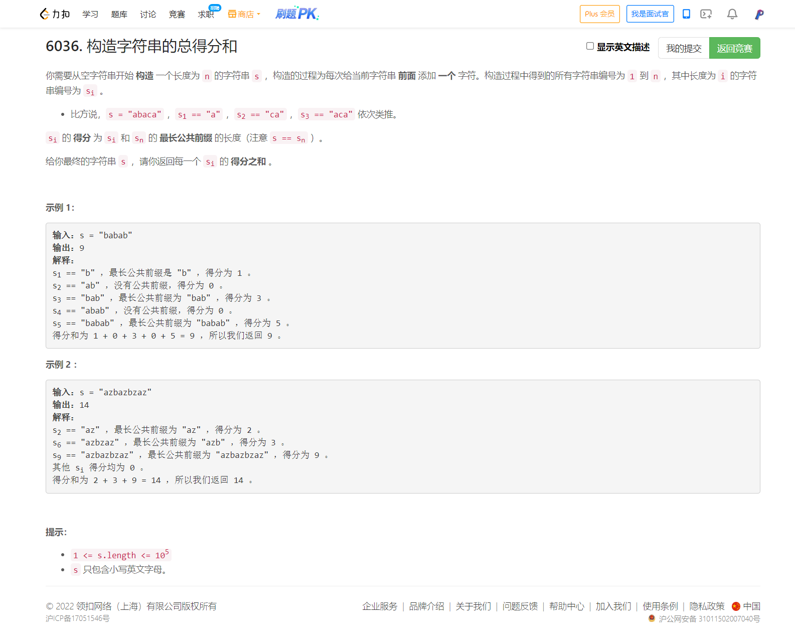

<!-- @import "[TOC]" {cmd="toc" depthFrom=1 depthTo=6 orderedList=false} -->

<!-- code_chunk_output -->

- [6036. 构造字符串的总得分和（扩展KMP/Z函数）](#6036-构造字符串的总得分和扩展kmpz函数)

<!-- /code_chunk_output -->

### 6036. 构造字符串的总得分和（扩展KMP/Z函数）



扩展 KMP 和 Z 函数是一个东西，这里就把这个知识点给记录了吧。

这里 https://oi-wiki.org/string/z-func/ 已经写得很清楚了。

精要就是维护一个最靠右的 z-box ，这个 z-box 左右端点分别为 l 和 r 。这个 z-box 的性质是： **是原字符串的前缀。** 首先考虑 i 是处于 z-box 中的，那么， i 对应的原字符前缀就是把 z-box 移动到原字符串开头的位置即 `z[i - l]` 。z-box 保证了 r 之前的内容都是已经确认的了，言外之意，我们并不知道 r 之后的东西是什么，因此，对于 i ，我们得用 `min(z[i - l], r - i + 1)` 卡一下长度，之后再建立以 i 为左端点的 z-box 。

其次，如果 i 不处于 z-box 中，也尝试建立以 i 为左端点的 z-box 。

```cpp
vector<int> z_function(string s) {
    int n = s.size();
    vector<int> z(n, n);
    for (int i = 1, l = 0, r = 0; i < n; ++ i) {
        z[i] = max(min(z[i - l], r - i + 1), 0);
        while (i + z[i] < n && s[z[i]] == s[i + z[i]]) {
            l = i;
            r = i + z[i];
            ++ z[i];
        }
    }
    return z;
}
```

时间复杂度 $O(n)$ 。

本题代码如下：

```cpp
class Solution {
    vector<int> z_function(string s) {
        int n = s.size();
        vector<int> z(n, n);
        for (int i = 1, l = 0, r = 0; i < n; ++ i) {
            z[i] = max(min(z[i - l], r - i + 1), 0);
            while (i + z[i] < n && s[z[i]] == s[i + z[i]]) {
                l = i;
                r = i + z[i];
                ++ z[i];
            }
        }
        return z;
    }
public:
    long long sumScores(string s) {
        vector<int> z = z_function(s);
        long long ans = 0;
        for (auto&& x: z)
            ans += x;
        return ans;
    }
};
```
