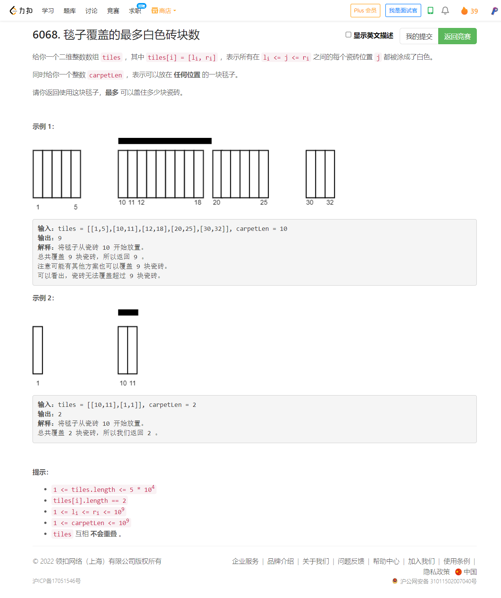
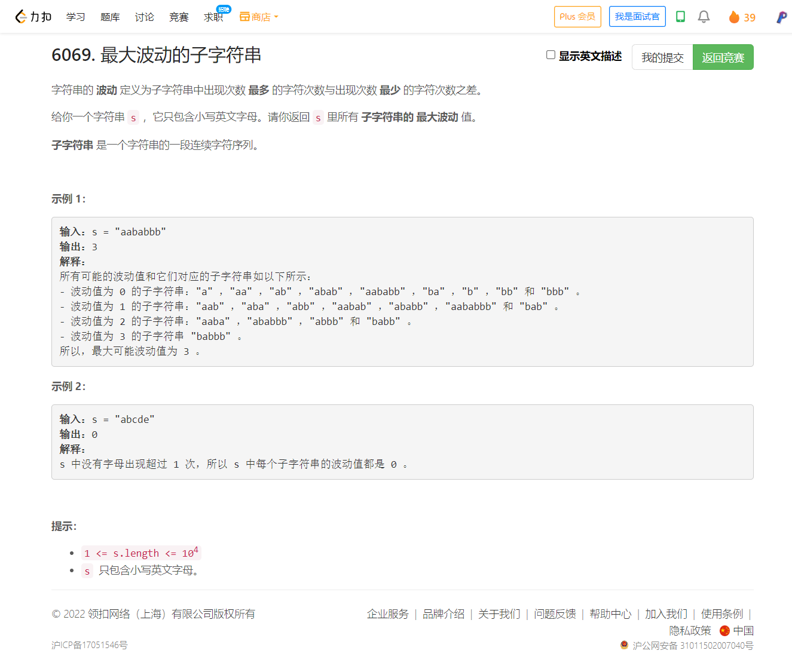

<!-- @import "[TOC]" {cmd="toc" depthFrom=1 depthTo=6 orderedList=false} -->

<!-- code_chunk_output -->

- [6068. 毯子覆盖的最多白色砖块数（贪心+滑动窗口）](#6068-毯子覆盖的最多白色砖块数贪心滑动窗口)
- [6069. 最大波动的子字符串](#6069-最大波动的子字符串)

<!-- /code_chunk_output -->

T3 依旧想复杂了，还好无 WA 。 T4 感觉功亏一篑？实际上就是不会，但是很近了，我也想到了 `26 * 26 * 1e4` 的时间复杂度。

### 6068. 毯子覆盖的最多白色砖块数（贪心+滑动窗口）



下面是我的代码。

```cpp
class Solution {
public:
    int maximumWhiteTiles(vector<vector<int>>& tiles, int carpetLen) {
        // unordered_map<int, int> S;
        vector<int> nums, ls, rs;
        for (auto&& tile: tiles)
        {
            nums.push_back(tile[0]);
            nums.push_back(tile[1]);
            ls.push_back(tile[0]);
            rs.push_back(tile[1]);
        }
        sort(nums.begin(), nums.end());
        sort(ls.begin(), ls.end());
        sort(rs.begin(), rs.end());
        int n = tiles.size();
        vector<int> sums(n * 2 + 1, 0);
        for (int i = 0; i < n * 2; ++ i)
        {
            if (i % 2) sums[i] = sums[i - 1] + nums[i] - nums[i - 1] + 1;
            else
            {
                if (i == 0) continue;
                sums[i] = sums[i - 1];
            }
        }
        
        if (nums[0] + carpetLen - 1 >= nums[n * 2 - 1])
        {
            // cout << "?";
            return sums[n * 2 - 1] - sums[0];
        }
        
        int maxv = -1;
        // 正向
        for (int i = 0; i < n * 2; i += 2)
        {
            int l = i / 2, r = n - 1;
            while (l < r)
            {
                int mid = l + r >> 1;
                if (rs[mid] < nums[i] + carpetLen) l = mid + 1;
                else r = mid;
            }
            // cout << r << " " << nums[i] << " " << rs[r] << " " << sums[r * 2] - sums[i] << endl;
            if (ls[r] > nums[i] + carpetLen - 1) maxv = max(maxv, sums[(r - 1) * 2 + 1] - sums[i]);
            else if (ls[r] <= nums[i] + carpetLen - 1 && rs[r] > nums[i] + carpetLen - 1) maxv = max(maxv, sums[r * 2] - sums[i] + nums[i] + carpetLen - ls[r]);
            else maxv = max(maxv, sums[r * 2 + 1] - sums[i]);
        }
        // cout << maxv << endl;
        // 反向
        for (int i = n * 2 - 1; i >= 0; i -= 2)
        {
            int l = i / 2, r = n - 1;
            while (l < r)
            {
                int mid = l + r + 1 >> 1;
                if (ls[mid] > nums[i] - carpetLen + 1) r = mid - 1;
                else l = mid;
            }
            if (rs[r] < nums[i] - carpetLen + 1) maxv = max(maxv, sums[i] - sums[r * 2 + 1]);
            else if (rs[r] >= nums[i] - carpetLen + 1 && ls[r] < nums[i] - carpetLen + 1) maxv = max(maxv, sums[i] - sums[r * 2 + 1] + rs[r] - (nums[i] - carpetLen));
            else maxv = max(maxv, sums[i] - sums[r * 2]);
        }
        // cout << maxv << endl;
        return maxv;
    }
};
```

[大佬](https://leetcode.cn/problems/maximum-white-tiles-covered-by-a-carpet/solution/by-tsreaper-gde3/)的代码并没有把右端点开始的情况考虑，只考虑左端点覆盖的情况就够了。

```cpp
class Solution {
public:
    int maximumWhiteTiles(vector<vector<int>>& tiles, int carpetLen) {
        sort(tiles.begin(), tiles.end());
        long long now = 0, ans = 0;
        for (int i = 0, j = 0; i < tiles.size(); i++) {
            while (j < tiles.size() && tiles[j][1] + 1 - tiles[i][0] <= carpetLen) now += tiles[j][1] - tiles[j][0] + 1, j++;
            // 毯子无法完全覆盖第 j 组瓷砖
            if (j < tiles.size()) ans = max(ans, now + max(0, tiles[i][0] + carpetLen - tiles[j][0]));
            // 毯子可以完全覆盖第 j 组瓷砖
            else ans = max(ans, now);
            now -= tiles[i][1] - tiles[i][0] + 1;
        }
        return ans;
    }
};
```

### 6069. 最大波动的子字符串


