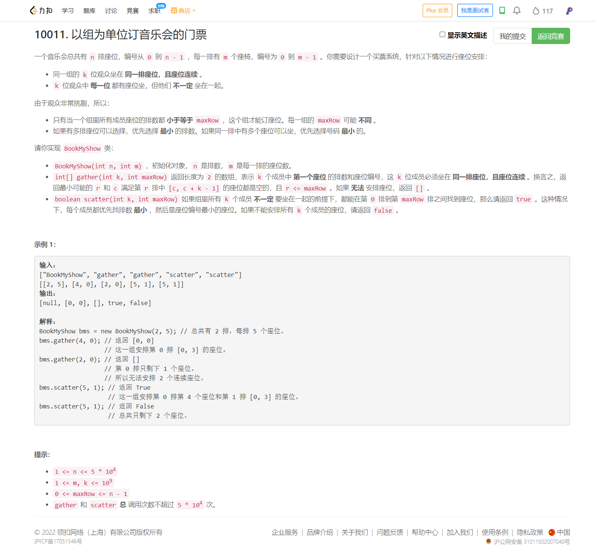

<!-- @import "[TOC]" {cmd="toc" depthFrom=1 depthTo=6 orderedList=false} -->

<!-- code_chunk_output -->

- [10011. 以组为单位订音乐会的门票（线段树二分/很棒的简化版线段树入门题）](#10011-以组为单位订音乐会的门票线段树二分很棒的简化版线段树入门题)

<!-- /code_chunk_output -->

前三题做慢了。 T4 想了想尝试了下，最后看灵佬对其评价很高，遂放弃。

### 10011. 以组为单位订音乐会的门票（线段树二分/很棒的简化版线段树入门题）



当时没有想到，周日晚上也没有想明白。

今天周二一下就想明白了，就是维护一个长度为 `n` 的序列，我们需要做的就是希望动态修改某一个值的同时，快速查询 `[1, R]` 之间的最小值，或快速查询 `[1, R]` 之间的区间和嘛。灵佬讲解的线段树我愿称之为 B 站最佳：[视频地址](https://www.bilibili.com/video/BV18t4y1p736?t=487) 。

这题放在线段树里，都可以作为简单题。

```cpp
class BookMyShow {
    int n, m;
    vector<int> min;
    vector<long long> sum;

    // 本题特设线段树方法：在 [L, R] 中查询满足 val >= min[] 的最小 i
    // 如果没有则返回 0 （这里从 1 开始计数）
    int query_min_index(int o, int l, int r, int L, int R, int val) {
        if (min[o] > val) return 0;  // o 节点对应的所有区间都不满足要求
        if (l == r) return l;
        int m = (l + r) / 2;
        if (min[o * 2] <= val) return query_min_index(o * 2, l, m, L, R, val);
        if (m < R) return query_min_index(o * 2 + 1, m + 1, r, L, R, val);
        return 0;
    }

    // 查询 L, R 区间和
    long long query_sum(int o, int l, int r, int L, int R) {
        if (l >= L && r <= R) return sum[o];
        long long s = 0;
        int m = (l + r) / 2;
        if (m >= L) s += query_sum(o * 2, l, m, L, R);
        if (m < R) s += query_sum(o * 2 + 1, m + 1, r, L, R);
        return s;
    }

    // add 值，别忘了 pushup
    void add(int o, int l, int r, int idx, int val) {
        if (l == r)
        {
            sum[o] += val;
            min[o] += val;
            return ;
        }
        // 向下寻找对应节点
        int m = (l + r) / 2;
        if (m >= idx) add(o * 2, l, m, idx, val);
        else add(o * 2 + 1, m + 1, r, idx, val);
        // pushup （下面的节点更新完了，更新上面的节点）
        sum[o] = sum[o * 2] + sum[o * 2 + 1];
        min[o] = std::min(min[o * 2], min[o * 2 + 1]);
    }

public:
    BookMyShow(int n, int m)
    : n(n), m(m), min(n * 4, 0), sum(n * 4, 0) {}
    
    vector<int> gather(int k, int maxRow) {  // 这里 maxRow 从 0 开始计数
        int idx = query_min_index(1, 1, n, 1, maxRow + 1, m - k);  // 从根节点 1 开始查询
        if (idx == 0) return {};
        // 查询区间 [idx, idx] 的和是多少（也就是 idx 以及有多少个座位）
        int seats = query_sum(1, 1, n, idx, idx);
        add(1, 1, n, idx, k);  // 给 idx 的数字加上 k
        return {idx - 1, seats};
    }
    
    bool scatter(int k, int maxRow) {
        if ((long long) (maxRow + 1) * m - query_sum(1, 1, n, 1, maxRow + 1) < k)
            return false;  // 剩余座位数量小于 k
        // 从第一个没满的座位开始
        for (int i = query_min_index(1, 1, n, 1, maxRow + 1, m - 1); ; ++ i)
        {
            int left_seats = m - query_sum(1, 1, n, i, i);
            if (k <= left_seats) {
                add(1, 1, n, i, k);
                return true;
            }
            k -= left_seats;
            add(1, 1, n, i, left_seats);
        }
    }
};

/**
 * Your BookMyShow object will be instantiated and called as such:
 * BookMyShow* obj = new BookMyShow(n, m);
 * vector<int> param_1 = obj->gather(k,maxRow);
 * bool param_2 = obj->scatter(k,maxRow);
 */
```

这里补充一下灵佬的 Go 代码。

```go
type seg []struct{ l, r, min, sum int }

func (t seg) build(o, l, r int) {
	t[o].l, t[o].r = l, r
	if l == r {
		return
	}
	m := (l + r) >> 1
	t.build(o<<1, l, m)
	t.build(o<<1|1, m+1, r)
}

// 将 idx 上的元素值增加 val
func (t seg) add(o, idx, val int) {
	if t[o].l == t[o].r {
		t[o].min += val
		t[o].sum += val
		return
	}
	m := (t[o].l + t[o].r) >> 1
	if idx <= m {
		t.add(o<<1, idx, val)
	} else {
		t.add(o<<1|1, idx, val)
	}
	lo, ro := t[o<<1], t[o<<1|1]
	t[o].min = min(lo.min, ro.min)
	t[o].sum = lo.sum + ro.sum
}

// 返回区间 [l,r] 内的元素和
func (t seg) querySum(o, l, r int) (sum int) {
	if l <= t[o].l && t[o].r <= r {
		return t[o].sum
	}
	m := (t[o].l + t[o].r) >> 1
	if l <= m {
		sum += t.querySum(o<<1, l, r)
	}
	if r > m {
		sum += t.querySum(o<<1|1, l, r)
	}
	return
}

// 返回区间 [1,R] 中 <= val 的最靠左的位置，不存在时返回 0
func (t seg) index(o, r, val int) int {
	if t[o].min > val { // 说明整个区间的元素值都大于 val
		return 0
	}
	if t[o].l == t[o].r {
		return t[o].l
	}
	m := (t[o].l + t[o].r) >> 1
	if t[o<<1].min <= val { // 看看左半部分
		return t.index(o<<1, r, val)
	}
	if m < r { // 看看右半部分
		return t.index(o<<1|1, r, val)
	}
	return 0
}

type BookMyShow struct {
	seg
	m int
}

func Constructor(n, m int) BookMyShow {
	t := make(seg, n*4)
	t.build(1, 1, n)
	return BookMyShow{t, m}
}

func (t BookMyShow) Gather(k, maxRow int) []int {
	i := t.index(1, maxRow+1, t.m-k)
	if i == 0 { // 不存在
		return nil
	}
	seats := t.querySum(1, i, i)
	t.add(1, i, k) // 占据 k 个座位
	return []int{i - 1, seats}
}

func (t BookMyShow) Scatter(k, maxRow int) bool {
	if (maxRow+1)*t.m-t.querySum(1, 1, maxRow+1) < k { // 剩余座位不足 k 个
		return false
	}
	// 从第一个没有坐满的排开始占座
	for i := t.index(1, maxRow+1, t.m-1); ; i++ {
		leftSeats := t.m - t.querySum(1, i, i)
		if k <= leftSeats { // 剩余人数不够坐后面的排
			t.add(1, i, k)
			return true
		}
		k -= leftSeats
		t.add(1, i, leftSeats)
	}
}

func min(a, b int) int { if a > b { return b }; return a }
```
