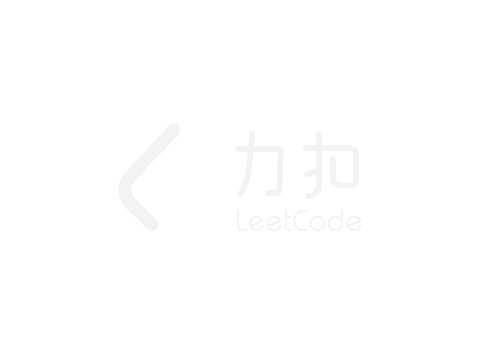
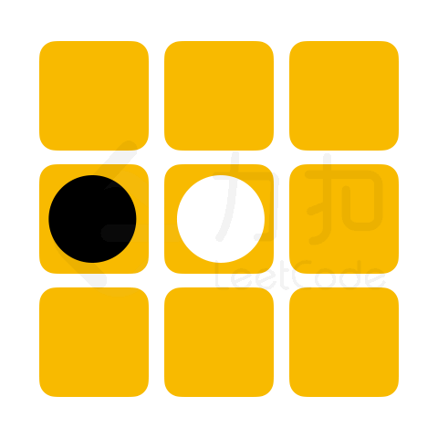
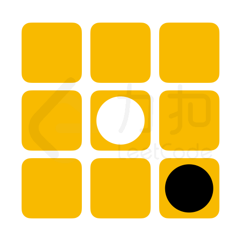
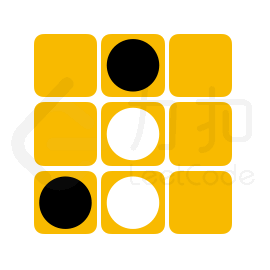
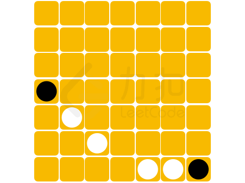
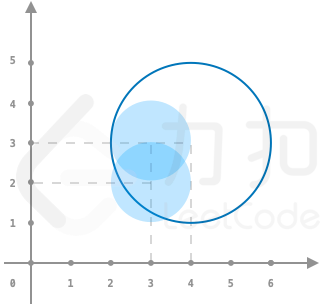
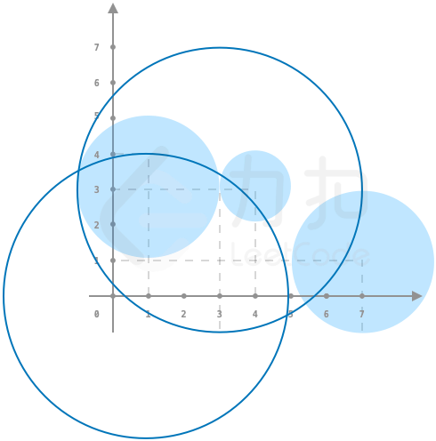
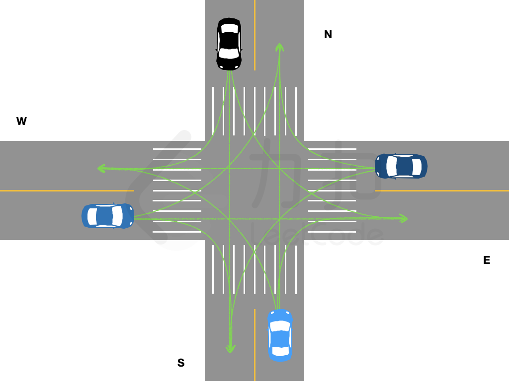

<!-- @import "[TOC]" {cmd="toc" depthFrom=1 depthTo=6 orderedList=false} -->

<!-- code_chunk_output -->

- [无人机方阵](#无人机方阵)
- [心算挑战](#心算挑战)
- [黑白翻转棋](#黑白翻转棋)
- [玩具套圈](#玩具套圈)
- [十字路口的交通](#十字路口的交通)

<!-- /code_chunk_output -->

没参加。

### 无人机方阵

在 「力扣挑战赛」 开幕式的压轴节目 「无人机方阵」中，每一架无人机展示一种灯光颜色。 无人机方阵通过两种操作进行颜色图案变换：
- 调整无人机的位置布局
- 切换无人机展示的灯光颜色

给定两个大小均为 N*M 的二维数组 source 和 target 表示无人机方阵表演的两种颜色图案，由于无人机切换灯光颜色的耗能很大，请返回从 source 到 target 最少需要多少架无人机切换灯光颜色。

注意： 调整无人机的位置布局时无人机的位置可以随意变动。

示例 1：



```
输入：source = [[1,3],[5,4]], target = [[3,1],[6,5]]

输出：1

解释：
最佳方案为
将 [0,1] 处的无人机移动至 [0,0] 处；
将 [0,0] 处的无人机移动至 [0,1] 处；
将 [1,0] 处的无人机移动至 [1,1] 处；
将 [1,1] 处的无人机移动至 [1,0] 处，其灯光颜色切换为颜色编号为 6 的灯光；
因此从source 到 target 所需要的最少灯光切换次数为 1。
8819ccdd664e91c78cde3bba3c701986.gif
```

示例 2：
```
输入：source = [[1,2,3],[3,4,5]], target = [[1,3,5],[2,3,4]]

输出：0
解释：
仅需调整无人机的位置布局，便可完成图案切换。因此不需要无人机切换颜色
```

提示：
- n == source.length == target.length
- m == source[i].length == target[i].length
- 1 <= n, m <=100
- 1 <= source[i][j], target[i][j] <=$10^4$

```cpp

```

### 心算挑战

「力扣挑战赛」心算项目的挑战比赛中，要求选手从 `N` 张卡牌中选出 `cnt` 张卡牌，若这 `cnt` 张卡牌数字总和为偶数，则选手成绩「有效」且得分为 `cnt` 张卡牌数字总和。
给定数组 `cards` 和 `cnt，其中` `cards[i]` 表示第 `i` 张卡牌上的数字。 请帮参赛选手计算最大的有效得分。若不存在获取有效得分的卡牌方案，则返回 `0`。

示例 1：
```
输入：cards = [1,2,8,9], cnt = 3

输出：18

解释：选择数字为 1、8、9 的这三张卡牌，此时可获得最大的有效得分 1+8+9=18。
```

示例 2：
```
输入：cards = [3,3,1], cnt = 1

输出：0

解释：不存在获取有效得分的卡牌方案。
```

提示：
- 1 <= cnt <= cards.length <= $10^5$
- 1 <= cards[i] <= 1000

```cpp

```

### 黑白翻转棋

在 n*m 大小的棋盘中，有黑白两种棋子，黑棋记作字母 "X", 白棋记作字母 "O"，空余位置记作 "."。当落下的棋子与其他相同颜色的棋子在行、列或对角线完全包围（中间不存在空白位置）另一种颜色的棋子，则可以翻转这些棋子的颜色。

  

「力扣挑战赛」黑白翻转棋项目中，将提供给选手一个未形成可翻转棋子的棋盘残局，其状态记作 chessboard。若下一步可放置一枚黑棋，请问选手最多能翻转多少枚白棋。

注意：
- 若翻转白棋成黑棋后，棋盘上仍存在可以翻转的白棋，将可以 继续 翻转白棋
- 输入数据保证初始棋盘状态无可以翻转的棋子且存在空余位置

示例 1：
```
输入：chessboard = ["....X.","....X.","XOOO..","......","......"]

输出：3

解释：
可以选择下在 [2,4] 处，能够翻转白方三枚棋子。
```

示例 2：



```
输入：chessboard = [".X.",".O.","XO."]

输出：2

解释：
可以选择下在 [2,2] 处，能够翻转白方两枚棋子。
2126c1d21b1b9a9924c639d449cc6e65.gif
```

示例 3：



```
输入：chessboard = [".......",".......",".......","X......",".O.....","..O....","....OOX"]

输出：4

解释：
可以选择下在 [6,3] 处，能够翻转白方四枚棋子。
803f2f04098b6174397d6c696f54d709.gif
```

提示：
- 1 <= chessboard.length, chessboard[i].length <= 8
- chessboard[i] 仅包含 "."、"O" 和 "X"

```cpp

```

### 玩具套圈

「力扣挑战赛」场地外，小力组织了一个套玩具的游戏。所有的玩具摆在平地上，`toys[i]` 以 `[xi,yi,ri]` 的形式记录了第 i 个玩具的坐标 `(xi,yi)` 和半径 ri。小扣试玩了一下，他扔了若干个半径均为 r 的圈，`circles[j]` 记录了第 j 个圈的坐标 `(xj,yj)`。套圈的规则如下：
- 若一个玩具被某个圈完整覆盖了（即玩具的任意部分均在圈内或者圈上），则该玩具被套中。
- 若一个玩具被多个圈同时套中，最终仅计算为套中一个玩具

请帮助小扣计算，他成功套中了多少玩具。

注意：
- 输入数据保证任意两个玩具的圆心不会重合，但玩具之间可能存在重叠。

示例 1：



```
输入：toys = [[3,3,1],[3,2,1]], circles = [[4,3]], r = 2

输出：1

解释： 如图所示，仅套中一个玩具
```

示例 2：



```
输入：toys = [[1,3,2],[4,3,1],[7,1,2]], circles = [[1,0],[3,3]], r = 4

输出：2

解释： 如图所示，套中两个玩具
```

提示：
- 1 <= toys.length <= $10^4$
- 0 <= toys[i][0], toys[i][1] <= $10^9$
- 1 <= circles.length <= $10^4$
- 0 <= circles[i][0], circles[i][1] <= $10^9$
- 1 <= toys[i][2], r <= 10

```cpp

```

### 十字路口的交通

前往「力扣挑战赛」场馆的道路上，有一个拥堵的十字路口，该十字路口由两条双向两车道的路交叉构成。由于信号灯故障，交警需要手动指挥拥堵车辆。假定路口没有新的来车且一辆车从一个车道驶入另一个车道所需的时间恰好为一秒钟，长度为 4 的一维字符串数组 `directions` 中按照 东、南、西、北 顺序记录了四个方向从最靠近路口到最远离路口的车辆计划开往的方向。其中：
- "E" 表示向东行驶；
- "S" 表示向南行驶；
- "W" 表示向西行驶；
- "N" 表示向北行驶。

交警每秒钟只能指挥各个车道距离路口最近的一辆车，且每次指挥需要满足如下规则：
- 同一秒钟内，一个方向的车道只允许驶出一辆车；
- 同一秒钟内，一个方向的车道只允许驶入一辆车；
- 同一秒钟内，车辆的行驶路线不可相交。

请返回最少需要几秒钟，该十字路口等候的车辆才能全部走完。

各个车道驶出的车辆可能的行驶路线如图所示：



注意：
- 测试数据保证不会出现掉头行驶指令，即某一方向的行驶车辆计划开往的方向不会是当前车辆所在的车道的方向;
- 表示堵塞车辆行驶方向的字符串仅用大写字母 "E"，"N"，"W"，"S" 表示。

示例 1：
```
输入：directions = ["W","N","ES","W"]

输出：2

解释：
第 1 秒：东西方向排在最前的车先行，剩余车辆状态 ["","N","S","W"]；
第 2 秒：南、西、北方向的车行驶，路口无等待车辆；
因此最少需要 2 秒，返回 2。
```

示例 2：
```
输入：directions = ["NS","WE","SE","EW"]

输出：3

解释：
第 1 秒：四个方向排在最前的车均可驶出；
第 2 秒：东南方向的车驶出，剩余车辆状态 ["","","E","W"]；
第 3 秒：西北方向的车驶出。
```

提示：
- directions.length = 4
- 0 <= directions[i].length <= 20

```cpp

```
