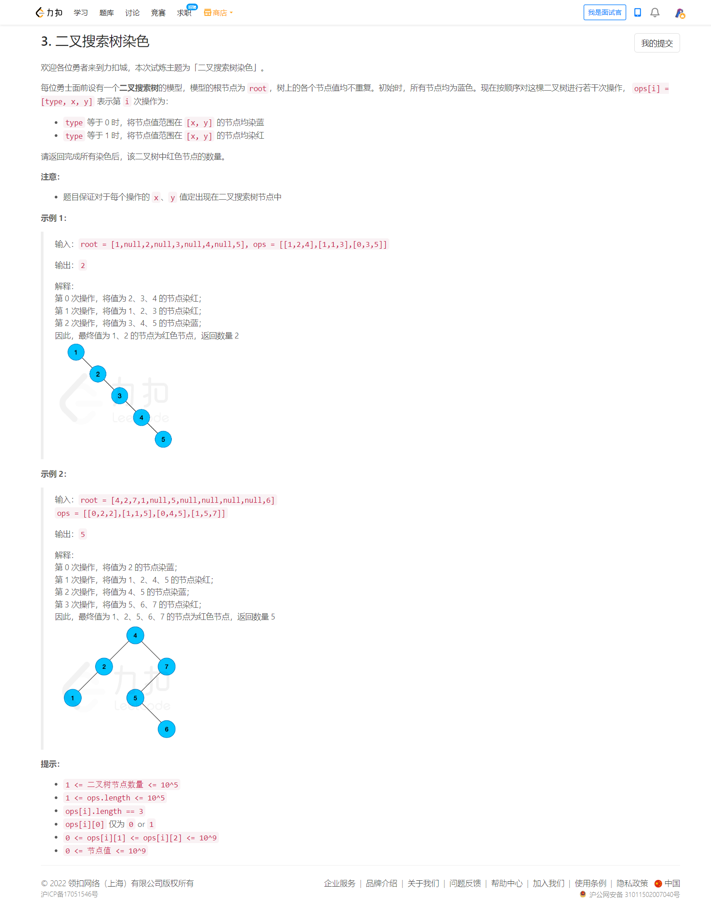
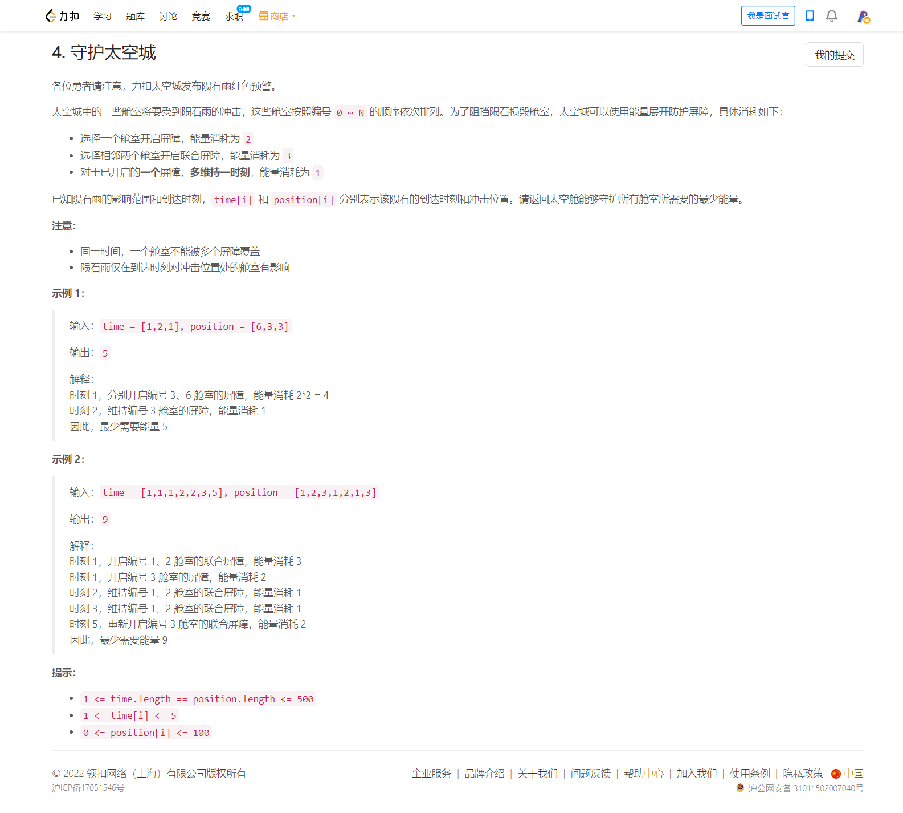
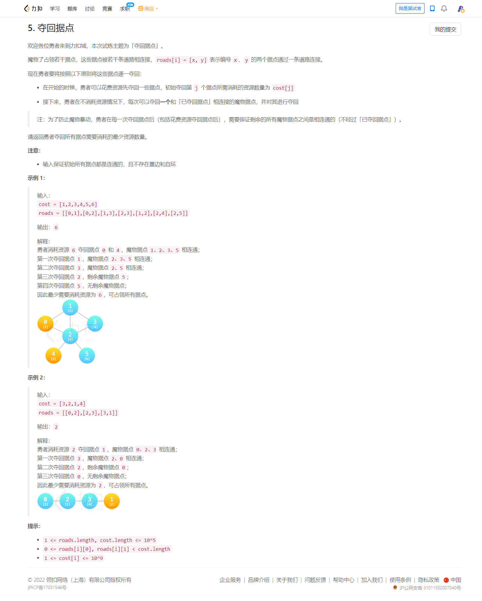

<!-- @import "[TOC]" {cmd="toc" depthFrom=1 depthTo=6 orderedList=false} -->

<!-- code_chunk_output -->

- [LCP 52. 二叉搜索树染色（逆序思维/set删除元素）](#lcp-52-二叉搜索树染色逆序思维set删除元素)
- [LCP 53. 守护太空城（很难的状压DP）](#lcp-53-守护太空城很难的状压dp)
- [LCP 54. 夺回据点（点双连通分量缩点）](#lcp-54-夺回据点点双连通分量缩点)

<!-- /code_chunk_output -->

七点京东笔试，这个是三点钟的，两个半小时，之前和孙乐复习比较累，这个不参加了。听说第四题开始巨难。

### LCP 52. 二叉搜索树染色（逆序思维/set删除元素）



```cpp
/**
 * Definition for a binary tree node.
 * struct TreeNode {
 *     int val;
 *     TreeNode *left;
 *     TreeNode *right;
 *     TreeNode(int x) : val(x), left(NULL), right(NULL) {}
 * };
 */
class Solution {
    set<int> S;
    void dfs(TreeNode *u)
    {
        if (u->left) dfs(u->left);
        S.insert(u->val);
        if (u->right) dfs(u->right);
    }
public:
    int getNumber(TreeNode* root, vector<vector<int>>& ops) {
        // 首先中序遍历，因为是二叉搜索树
        S.clear();
        dfs(root);  // 其实不中序遍历也行，因为是 set
        
        // 之后倒着遍历 ops
        // 如果某个点被染色，则删去，是红色则 ++ ans
        int ans = 0;
        reverse(ops.begin(), ops.end());
        for (auto&& op: ops)
        {
            int l = op[1], r = op[2];
            while (true)
            {
                auto u = S.lower_bound(l);  // 第一个大于等于 l 的点
                if (u == S.end() || *u > r) break;
                S.erase(u);  // 利用指针删除 set 中元素
                ans += op[0];
            }
        }
        return ans;
    }
};
```

### LCP 53. 守护太空城（很难的状压DP）



提示 1

考虑计算前 `i` 个舱室需要的最小能量，由于题目中只有联合屏障会涉及到相邻的舱室，因此可以往 DP 上去思考。

提示 2

枚举第 `i-1` 个舱室在哪些时间点（记作 $\textit{pre}$ 集合）开启了联合屏障，这会产生如下影响（限制）：
- 第 i−1 个舱室在不属于 $\textit{pre}$ 集合的时间点，若受到陨石雨的冲击，必须开启单独屏障（因为只有单独屏障和联合屏障两种防护方式）；
- 第 i 个舱室在属于 $\textit{pre}$ 集合的时间点，由于被第 $i-1$ 个舱室的联合屏障保护，无需开启任何屏障；
- 第 $i$ 个舱室在不属于 $\textit{pre}$ 集合的时间点，若受到陨石雨的冲击，必须选择开启单独屏障，或者选择开启联合屏障。

提示 3
将「开启联合屏障的时间点集合」当作状态中的一个维度。
- 定义 $f[i][j]$ 表示考虑前 $i$ 个舱室，且第 $i$ 个舱室与第 $i+1$ 个舱室开启联合屏障的时间点集合为 $j$ 时，所需的最小能量。

根据提示 2，我们需要枚举第 i 个舱室开启联合屏障的时间点集合 j，由于联合屏障的限制，我们还需要枚举第 i-1 个舱室开启联合屏障的时间点集合 $\textit{pre}$，满足 $\textit{pre}\cap j=\varnothing$ ，即集合 $\textit{pre}$ 与集合 j 的交集为空。

剩下需要考虑的就是既不属于集合 $\textit{pre}$ 又不属于集合 j 的时间点了，如果在这些时间点上受到陨石雨的冲击，那么对应的时间点必须单独开启屏障。

记 $\textit{single}[j]$ 表示时间点集合为 j 时，开启单独屏障时最少需要的能量。这可以贪心地计算：如果两个时间点相邻，则可以花费 1 能量继续维持，否则花费 2 能量重新开启。

记 $\textit{union}[j]$ 表示时间点集合为 j 时，开启联合屏障时最少需要的能量。这也可以仿照上述过程计算出来。

因此有

$$
f[i][j] = \min_{\textit{pre}\cap j=\varnothing} f[i-1][\textit{pre}] + \textit{union}[j] + \textit{single}[k]
$$

其中 k 为既不属于集合 $\textit{pre}$ 又不属于集合 j，且第 i 个舱室受到陨石雨冲击的时间点集合。

最后答案为 $f[n][\varnothing]$，其中 $n=\max(\textit{position})$ 。最后一个舱室无需开启联合屏障。

代码实现时，$\textit{single}$ 和 $\textit{union}$ 都可以预处理出来，且用二进制表示集合。

时间复杂度为 $O(n\cdot 3^m)$ ，其中 $n=\max(\textit{position})$，$m=\max(\textit{time})$ 。对于每个舱室 i，状态转移次数为 j 的每个子集的子集个数之和，由于元素个数为 k 的集合有 $C(m,k)$ 个，其子集有 $2^k$ 个，根据二项式定理，$\sum C(m,k)2^k = (2+1)^m = 3^m$ ，所以对每个 i，状态转移次数为 $O(3^m)$ ，因此总的时间复杂度为 $O(n\cdot 3^m)$ 。

作者：endlesscheng
链接：https://leetcode-cn.com/problems/EJvmW4/solution/by-endlesscheng-pk2q/

```cpp
class Solution {
public:
    int defendSpaceCity(vector<int> &time, vector<int> &position) {
        int n = *max_element(position.begin(), position.end());
        int m = 1 << *max_element(time.begin(), time.end());
        vector<int> rain(n + 1);
        for (int i = 0; i < time.size(); ++i)
            rain[position[i]] |= 1 << (time[i] - 1);

        vector<int> un(m), single(m);
        for (int i = 1; i < m; ++i) {
            int lb = i & -i, j = i ^ lb, lb2 = j & -j;
            un[i] = un[j] + (lb == (lb2 >> 1) ? 1 : 3); // lb == (lb2 >> 1) 表示两个时间点相邻
            single[i] = single[j] + (lb == (lb2 >> 1) ? 1 : 2); // 递推
        }

        vector<vector<int>> f(n + 1, vector<int>(m, INT_MAX / 2));
        for (int i = 0; i <= n; ++i)
            for (int j = 0; j < m; ++j)
                // 枚举 j 的补集 mask 中的子集 pre
                for (int mask = (m - 1) ^ j, pre = mask;; pre = (pre - 1) & mask) {
                    int cost = (i ? f[i - 1][pre] : 0) + un[j] + single[(mask ^ pre) & rain[i]];
                    f[i][j] = min(f[i][j], cost);
                    if (pre == 0) break;
                }
        return f[n][0];
    }
};
```

### LCP 54. 夺回据点（点双连通分量缩点）



解法：点双连通分量缩点

要求保留连通性，很容易想到点双连通分量和割点。

简化问题：树上的情况

首先考虑简化问题：题目给出的是一棵树，并按要求夺回据点。

容易发现，一开始只能选择叶子节点（选非叶子节点树直接不连通），而且若这棵树有 k 个叶子，我们至少选择其中的 (k - 1) 个。因此我们选择权值最小的 (k - 1) 个叶子即可。

原问题

将所有点双连通分量 缩点 得到一棵树，题目转换为树上的情况。每个点的权值是该双连通分量中非割点权值的最小值。

这个做法的正确性建立在如下事实的基础上：
- 考虑一个单独的点双连通分量，一开始只需要选一个点，就能合法地占领整个点双连通分量；
- 点双连通分量缩点后得到的一定是一棵树；
- 缩点后得到的树的叶子一定不是原图中的割点。

作者：tsreaper
链接：https://leetcode-cn.com/problems/s5kipK/solution/by-tsreaper-z8by/

这个知识点没学过，先跳。

```cpp
class Solution {
    const int S = 0;
    int n;

    vector<vector<int>> e;
    vector<bool> isCut;
    vector<int> dfn, low;
    int clk = 0;
    stack<int> stk;
    // 所有点双连通分量
    vector<vector<int>> dcc;

    void tarjan(int sn) {
        dfn[sn] = low[sn] = ++clk;
        stk.push(sn);
        int flag = 0;
        for (int fn : e[sn]) {
            if (!dfn[fn]) {
                tarjan(fn);
                low[sn] = min(low[sn], low[fn]);
                if (low[fn] >= dfn[sn]) {
                    flag++;
                    if (sn != S || flag > 1) isCut[sn] = true;
                    int t;
                    dcc.push_back(vector<int>());
                    do {
                        t = stk.top(); stk.pop();
                        dcc.back().push_back(t);
                    } while (t != fn);
                    dcc.back().push_back(sn);
                }
            } else low[sn] = min(low[sn], dfn[fn]);
        }
    }

public:
    long long minimumCost(vector<int>& cost, vector<vector<int>>& roads) {
        n = cost.size();
        if (n == 1) return cost[0];

        e = vector<vector<int>>(n);
        for (auto &r : roads) e[r[0]].push_back(r[1]), e[r[1]].push_back(r[0]);
        isCut = vector<bool>(n);
        dfn = low = vector<int>(n);
        tarjan(S);

        // 整张图是一个双连通分量，选择整张图权值最小的点即可
        if (dcc.size() == 1) {
            int ans = 2e9;
            for (int x : cost) ans = min(ans, x);
            return ans;
        }

        vector<int> vec;
        for (auto &c : dcc) {
            int cnt = 0, mn = 2e9;
            for (int x : c) {
                if (isCut[x]) cnt++;
                else mn = min(mn, cost[x]);
            }
            // 该双连通分量只和一个割点相连，是缩点形成的树的叶子节点
            if (cnt == 1) vec.push_back(mn);
        }
        sort(vec.begin(), vec.end());
        long long ans = 0;
        for (int i = 0; i + 1 < vec.size(); i++) ans += vec[i];
        return ans;
    }
};
```
