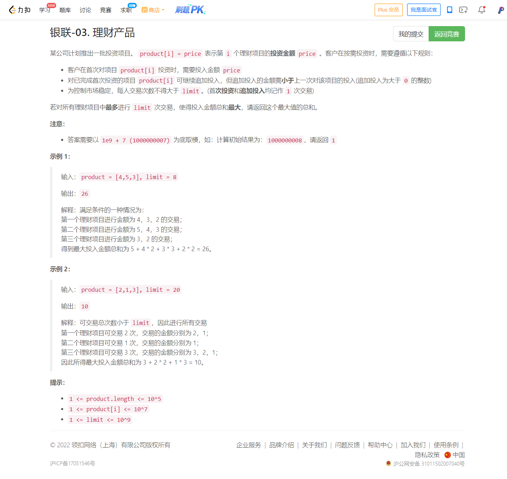
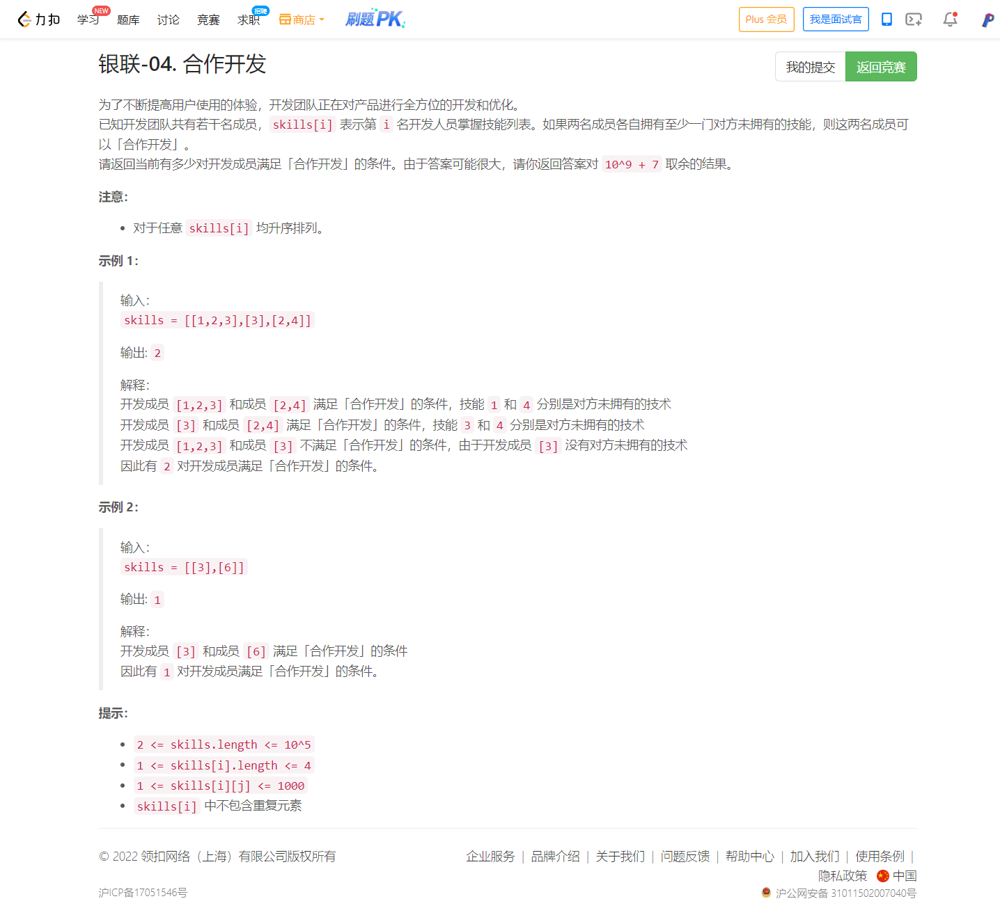

<!-- @import "[TOC]" {cmd="toc" depthFrom=1 depthTo=6 orderedList=false} -->

<!-- code_chunk_output -->

- [银联-03. 理财产品（堆模拟/二分答案）](#银联-03-理财产品堆模拟二分答案)
- [银联-04. 合作开发（状态压缩+取补集）](#银联-04-合作开发状态压缩取补集)

<!-- /code_chunk_output -->

T3 写得乱乱糟糟的，思路比较明确，但是爆了好几次 long long ；而灵佬的思路显然不同，更妙一点。

T4 想到了状压，但还不够深入、不够大胆。

### 银联-03. 理财产品（堆模拟/二分答案）



以下是我很乱的代码：

```cpp
class Solution {
public:
    int maxInvestment(vector<int>& product, int limit) {
        long long ans = 0;
        long long mod = 1e9 + 7;
        sort(product.begin(), product.end());
        map<int, int> cnt;
        priority_queue<pair<int, int>> heap;
        heap.push({0, 0});
        for (auto&& p: product)
            cnt[p] ++ ;
        for (auto&& [k, v]: cnt)
            heap.push({k, v});
        while (limit > 0)
        {
            auto t = heap.top();
            int upper = t.first;
            heap.pop();
            if (upper == 0) return ans;
            int lower = heap.top().first;
            int width = t.second;
            if ((upper - lower) * width > limit)
            {
                // cout << limit << " " << width << " " << upper << " " << lower << " " << ans << endl;
                // ans = (((limit / width) * (upper - lower) + (limit % width) + ans) % mod;
                ans = (ans + ((long long)upper + upper - limit / width + 1) * (limit / width) / 2 * width + (limit % width) * ((long long)upper - limit / width)) % mod;
                return ans;
            }
            else
            {
                ans = (((long long)upper + lower + 1) * (upper - lower) / 2 * width + ans) % mod;
                limit -= (upper - lower) * width;
                t = {lower, heap.top().second + width};
                heap.pop();
                heap.push(t);
            }
            // cout << ans << " :\n";
            // for (int i = 0; i < product.size(); ++ i)
            //     cout << product[i] << " ";
            // cout << endl;
        }
        cout << endl;
        return ans;
    }
};
```

灵佬先把 price 二分出来了。然后直接计算就行。我这里改成自己写的 C++ 版本。

```cpp
class Solution {
    // price+1 作为最后一次交易价格，是否满足 limit （所有能投资到 price+1 的都投资到 price+1）
    bool check(int price, int limit, const vector<int>& product)
    {
       long cnt = 0;
        for (auto&& p: product)
            if (p > price)
                cnt += p - price;
        // cout << price << " " << cnt << endl;
        return cnt <= limit;
    }
public:
    int maxInvestment(vector<int>& product, int limit) {
        int mod = 1e9 + 7;
        // 用二分算最后一次所有 product 交易价格的值
        int l = 0, r = 1e7;
        while (l < r)
        {
            int mid = l + r >> 1;
            if (check(mid, limit, product)) r = mid;
            else l = mid + 1;
        }
        int price = l;
        // cout << l << endl;

        long ans = 0;
        for (auto&& p: product)
            if (p >= price)
            {
                int cnt = p - price;  // 高度
                ans = (ans + (long) (price + 1 + p) * cnt / 2) % mod;
                limit -= cnt;
            }

        // 剩下的部分如果还有 limit ，则是这部分 limit 乘上 price - 1 这么多投资
        // 也可能是下面这样 limit > product.size() 说明最后一批顶多投资 product.size() 这么多了
        if (limit > product.size())
            limit = product.size();
        
        return (ans + (long) limit * price) % mod;
    }
};
```

### 银联-04. 合作开发（状态压缩+取补集）



考虑不满足合作开发的成员对数，这在其中一个成员的技能列表是另一个成员的技能列表的子集时成立。

遍历 $\textit{skills}$，由于每个成员的技能列表长度不超过 4，我们可以枚举技能列表的所有非空子集，存入一个集合（哈希表）$\textit{cnt}$ 中，这样对于第 i 个成员，$\textit{cnt}$ 中 $\textit{skills}[i]$ 的个数就是下标在 i 前面的无法与 i 合作开发的成员个数了。

为了保证后面遍历到的技能列表是前面某个技能列表的子集，我们需要将 $\textit{skills}$ 按照 $\textit{skills}[i]$ 的大小降序排序。

设 $\textit{skills}$ 的长度为 n，从 $\dfrac{n(n-1)}{2}$中减去这些无法合作开发的成员个数，即为答案。

代码实现时，由于技能值小于 $2^{10}$，4 个技能仅需 40 个比特存储，因此我们可以用一个 64 位的整数存下每个子集。

```cpp
class Solution {
public:
    int coopDevelop(vector<vector<int>>& skills) {
        int mod = 1e9 + 7;
        long ans = (long) skills.size() * (skills.size() - 1) / 2;
        // 按照数组大小降序排序，直接排可能超时（涉及到 vector 移动位置） 42 / 42 个通过测试用例
        // sort(skills.begin(), skills.end(), [](const vector<int>& a, const vector<int>& b) {
        //     return a.size() > b.size();
        // });
        // 所以排索引，但是也超时了 42 / 42 个通过测试用例
        vector<int> idx;
        for (int i = 0; i < skills.size(); ++ i) idx.push_back(i);
        sort(idx.begin(), idx.end(), [&](const int& a, const int& b) {
            return skills[a].size() > skills[b].size();
        });
        map<long, long> cnt;
        for (auto&& id: idx)
        {
            auto skill = skills[id];
            long s = 0;
            // 状压
            for (auto&& v: skill)
                s = (s << 10) | v;
            // 去掉之前已经出现过的或出现过的子集
            ans -= cnt[s];
            // 枚举 skill 所有非空子集
            for (int i = 1; i < (1 << skill.size()); ++ i)
            {
                long t = 0;
                for (int j = 0; j < skill.size(); ++ j)
                {
                    long v = skill[j];
                    if ((i >> j) & 1)
                        t = (t << 10) | v;
                }
                cnt[t] ++ ;
            }
        }
        return ans % mod;
    }
};
```
