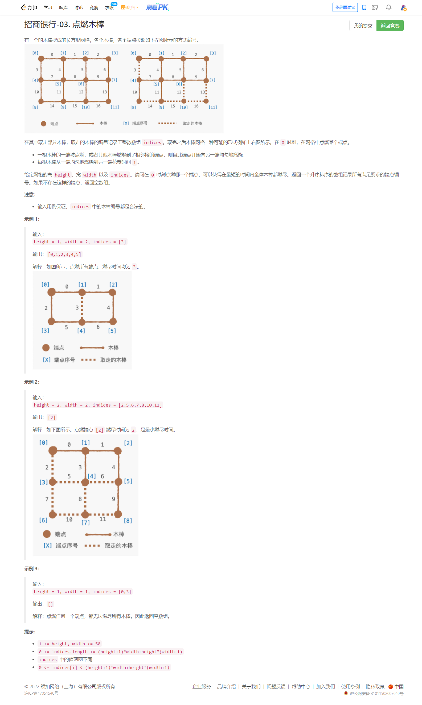
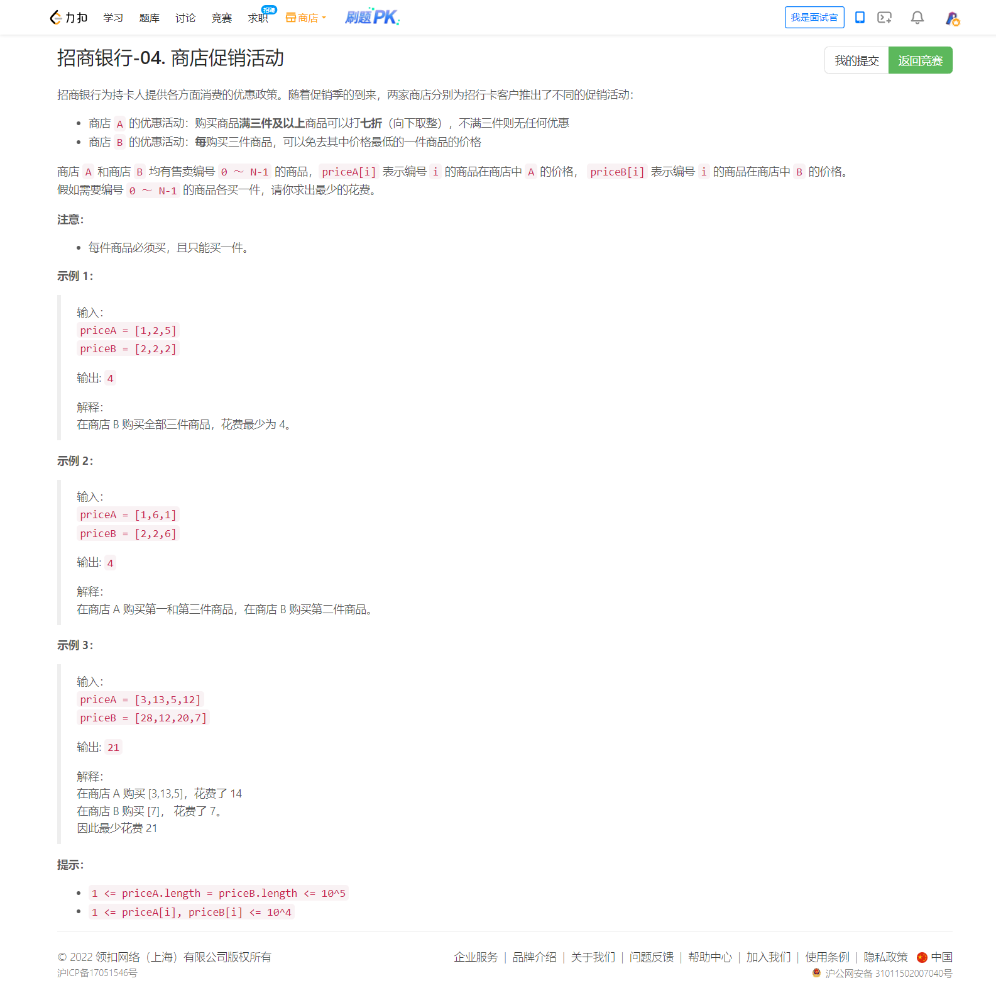

<!-- @import "[TOC]" {cmd="toc" depthFrom=1 depthTo=6 orderedList=false} -->

<!-- code_chunk_output -->

- [招商银行-03. 点燃木棒（建图bfs）](#招商银行-03-点燃木棒建图bfs)
- [招商银行-04. 商店促销活动（复杂的dp）](#招商银行-04-商店促销活动复杂的dp)

<!-- /code_chunk_output -->

|排名|得分|题目1|题目2|题目3|题目4|结算|
|---|---|---|---|---|---|---|
|123 / 1529|7|0:07:05🐛0|0:11:27🐛0|||0:11:27|

T2 勇敢假设，只是求各个节点的度就好。

T3 想复杂了，道理方法我都明白。

### 招商银行-03. 点燃木棒（建图bfs）



```cpp
class Solution {
public:
    vector<int> lightSticks(int height, int width, vector<int>& indices) {
        // 参考大佬 https://leetcode-cn.com/u/lucifer1004/ 吴自华
        // n 总节点 m 总火柴
        int n = (height + 1) * (width + 1), m = (height + 1) * width + height * (width + 1);
        vector<vector<int>> adj(n);
        vector<bool> bad(m);
        for (int idx : indices)
            bad[idx] = true;
        // 求节点 idx 的邻接节点
        // 这里由 i 推出火柴编号的公式我没想到
        for (int i = 0; i <= height; ++i)
            for (int j = 0; j <= width; ++j) {
                int idx = i * (width + 1) + j;  // 第 idx 个节点
                if (i + 1 <= height) {  // 下面的边
                    int nxt = (i + 1) * (width + 1) + j;
                    int edge = (i + 1) * width + i * (width + 1) + j;
                    if (!bad[edge]) {
                        adj[idx].push_back(nxt);
                        adj[nxt].push_back(idx);
                    }
                }
                
                if (j + 1 <= width) {  // 右边的边
                    int nxt = i * (width + 1) + j + 1;
                    int edge = i * width + i * (width + 1) + j;
                    if (!bad[edge]) {
                        adj[idx].push_back(nxt);
                        adj[nxt].push_back(idx);
                    }
                }
            }
        
        int cnt = 0;
        
        // 把问题转换为所有的点都要被遍历到
        for (int i = 0; i < n; ++i)
            if (!adj[i].empty())
                cnt++;
        
        // 从每个节点开始 bfs
        int best = INT_MAX;
        vector<int> ans;
        for (int i = 0; i < n; ++i) {
            queue<pair<int, int>> q;
            q.emplace(i, 0);  // q = { {节点, 距离} }
            int rem = cnt - 1;
            vector<bool> vis(n);  // vector< bool> 并不是一个通常意义上的vector容器
            vis[i] = true;
            int hi = 0;
            
            while (!q.empty()) {
                auto [u, t] = q.front();
                q.pop();
                hi = t;
                for (int v : adj[u]) {
                    if (!vis[v]) {
                        vis[v] = true;
                        rem--;
                        q.emplace(v, t + 1);
                    }
                }
            }
            
            if (rem != 0)
                continue;
            
            if (hi < best) {
                ans.clear();
                best = hi;
            }
            
            if (hi == best)
                ans.push_back(i);
        }
        
        return ans;
    }
};
```

### 招商银行-04. 商店促销活动（复杂的dp）



**Hint1**

每三个数里最小的那个数可能到这三个数之和的33%，也可能远小于30%，而A的选法相当于免去30%，好像贪心不大可做的样子。

**Hint2**

如果告诉你这题是dp，你能想到怎么做吗？

**Hint3**

b数组的状态怎么表示？

对于b数组，若每3个就能免费1次，那不满3个就会发生囤积。

我们只用关注囤积的个数，从2变为0的时候执行这次免费，而又因为执行免费的时候，是要免费那个最小的，所以我们可以按b从大到小排序。

**Hint4**

a数组的状态怎么表示？

如果取够了3个，无论最终取了多少个（10个和100个是一样的），都按0.7倍计算。

所以，状态可以设为0、1、2、3，分别表示a取了`0,1,2,>=3`个。

**Hint5**

如果最终a没取够3个，则前1个/前2个的代价按原价计算；如果最终取够了3个，则前1个/前2个的代价都按0.7倍计算。如何区分？

做两次dp。

第一次钦定取够3个（转移按0.7倍转移，只把a>=3的终态当合法状态）。

第二次钦定不够3个（转移按原价转移，只把a<3的终态当合法状态）。

Solution

先把pair，按b数组值从大到小排序。

`dp[i][4][3]`表示前i个，a数组取了`0/1/2/>=3`个，b数组发生囤积的个数有`0/1/2`个时的最小代价和。

分两次dp进行，第一次强制选满3个，把a的代价视为0.7倍的，第二次强制不满3个，把a的代价视为原价，转移时，考虑让第i个选a或是选b，特别地，当b已经屯了两个的时候，选了第三个，会让第三个免费。

再就是注意一些转移的细节，比如做第二次的dp数组实际只能用到dp[i][3][3]。

代码是先把代价`*7`，`*10`，最后总代价除以10。

如果你愿意的话，可以把dp数组写成滚动的。

```cpp
class Solution {
public:
    // 参考 不会dp不改名 https://leetcode-cn.com/circle/discuss/rhOa43/
    typedef long long ll;
    ll dp[100005][4][3];
    // node 用于排序，按照 b 中价格从大到小
    struct node{
        int a,b;
        node(){}
        node(int aa,int bb):a(aa),b(bb){}
        friend bool operator<(node a,node b){
            return a.b>b.b;
        }
    };
    void ckmin(ll &x, ll y){
        if(y==-1)return;
        if(x==-1)x=y;
        else x=min(x,y);
    }
    int goShopping(vector<int>& a, vector<int>& b) {
        int n=a.size();
        vector<node>c;
        for(int i=0;i<n;++i){
            c.push_back(node(a[i],b[i]));
        }
        sort(c.begin(),c.end());
        memset(dp,-1,sizeof dp);
        dp[0][0][0]=0;
        for(int i=0;i<n;++i){
            for(int j=0;j<=3;++j){
                for(int k=0;k<3;++k){
                    if(dp[i][j][k]==-1)continue;
                    ckmin(dp[i+1][min(j+1,3)][k],dp[i][j][k]+c[i].a*7ll);
                    ckmin(dp[i+1][j][(k+1)%3],dp[i][j][k]+(k==2?0:c[i].b*10ll));
                }
            }
        }
        long long ans=1e10;
        for(int k=0;k<3;++k){
            ckmin(ans,dp[n][3][k]);
        }
        memset(dp,-1,sizeof dp);
        dp[0][0][0]=0;
        for(int i=0;i<n;++i){
            for(int j=0;j<3;++j){
                for(int k=0;k<3;++k){
                    if(dp[i][j][k]==-1)continue;
                    if(j+1<3)ckmin(dp[i+1][j+1][k],dp[i][j][k]+c[i].a*10ll);
                    ckmin(dp[i+1][j][(k+1)%3],dp[i][j][k]+(k==2?0:c[i].b*10ll));
                }
            }
        }
        for(int j=0;j<3;++j){   
            for(int k=0;k<3;++k){
                ckmin(ans,dp[n][j][k]);
            }
        }
        return ans/10;
    }
};
```
