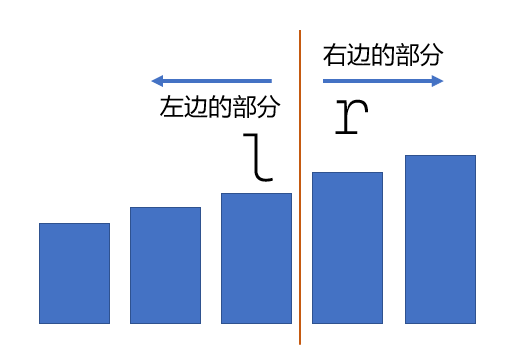

# 二分的边界、能力，何时应用二分法

参考题目：
- [../acwings/算法基础课/ybase01.md](../acwings/算法基础课/ybase01.md)
- [../acwings/《算法竞赛进阶指南》/0x00_04.md](../acwings/《算法竞赛进阶指南》/0x00_04.md)

### 二分最终都会面临...

二分最终都会面临如下图。



**记住这张图。心中有这张图。下面提到的图1都是指这张图。**

### 二分的边界

```cpp
while (l < r)
{
    int mid = l + r >> 1;
    if (check(mid)) r = mid;
    else l = mid + 1;
}
```

- 为什么 `l + r >> 1` 对应 `r = mid`？
  - 在图1的情况，`mid` 就是 `l` ，如果还有 `l = mid` 则陷入死循环
- 什么时候用 `l + r >> 1` ？
  - 我们这里有 `r = mid` ，则说明我们希望 `mid` 右边部分（包括 `mid`）满足 `check(mid)`
  - 如果 `check(mid)` 没有被满足，则我们需要向右寻找满足的临界点，因此 `l = mid + 1` （`mid` 没被满足，因此搜索区间不要再包括 `mid` 了，直接收缩到 `l = mid + 1`）

```cpp
while (l < r)
{
    int mid = l + r + 1>> 1;
    if (check(mid)) l = mid;
    else r = mid - 1;
}
```

同理：
- 为什么 `l + r + 1 >> 1` 对应 `l = mid`？
  - 在图1的情况，`mid` 就是 `r` ，如果还有 `r = mid` 则陷入死循环
- 什么时候用 `l + r + 1 >> 1` ？
  - 我们这里有 `l = mid` ，则说明我们希望 `mid` 左边部分（包括 `mid`）满足 `check(mid)`
  - 如果 `check(mid)` 没有被满足，则我们需要向左寻找满足的临界点，因此 `r = mid - 1` （`mid` 没被满足，因此搜索区间不要再包括 `mid` 了，直接收缩到 `r = mid - 1`）

总结一下：
- 让右边区间符合 `check` ，且最后通过二分找的点是在右边区间的最左边（属于右边区间的守门员），则咱们用 `r = mid` ，即 `int mid = l + r >> 1`

### 二分的能力（何时使用二分）

**当我们想提高搜索速度时，使用二分。**

一定要求序列是单调的吗？才能使用二分？

**实际上，我们需要切分序列来判断某个性质时，就可以使用二分搜索。**

甚至不需要切分左右区间，对于 `mid` ，我们仅仅判断包含 `mid` 的两个点（`mid - 1, mid` 或者 `mid, mid + 1`） 是否满足某个性质时，就可以使用二分。

具体题目见：[特殊排序](https://www.acwing.com/problem/content/115/)
